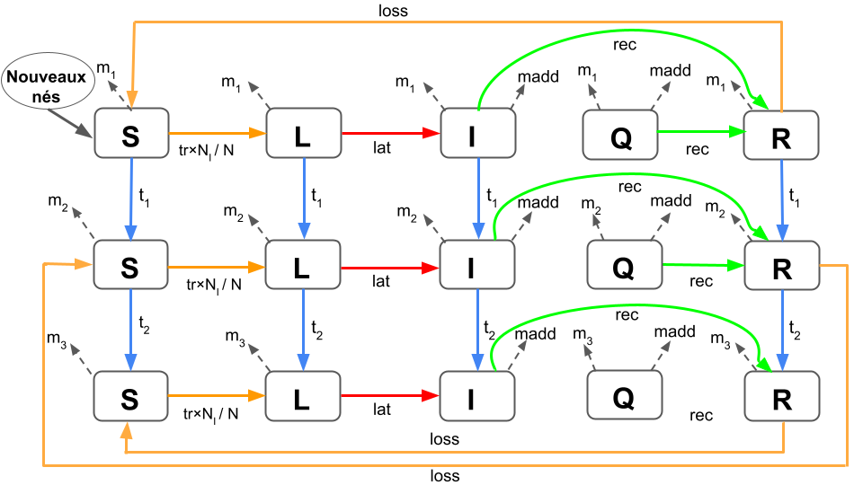

```{r setup, include=FALSE}
knitr::opts_chunk$set(echo = TRUE, warning = FALSE, message = FALSE, results = "hide")
```


```{r packages}
library(ggplot2) 
source("functionModProjet2023.r")
library(dplyr)
library(tidyr)
library(knitr) 
library(kableExtra)
library(reactable)
library(sensitivity)
library(labelled)
library(patchwork)
library(ggpubr)
```


# Description du modèle

## Type de modèle
Ce modèle est deterministe parce qu'il est défini par des équations deterministes ne comportant aucun terme tiré aléatoirement. Il est basé sur un pas de temps discret et est un modèle à compartiments.

## Processus biologique
Le modèle simule la propagation d'une maladie dans une population en fonction de divers processus biologiques, tels que la transmission de la maladie,  les taux de mortalité liés à la maladie ou naturels, la natalité, les temps d'immunisation et les temps de latence de la maladie.

## Equations associées 

Première classe d'âge : 

\begin{cases}
A_{S,t+1} = A_{S,t}\times(1-m_1-t-trans\times \frac{N_{I,t}}{N}) + loss \times A_{R,t} + max(0 , sr \times portée \times \sum_{i=1}^{4} B_{i, t} \times f_2 + \sum_{i=1}^{4} C_{i, t} \times f_3 \times (1- \frac{N}{K})) \\
A_{E,t+1} = A_{E,t}\times(1-m_1-t-lat) + trans \times A_{1,t} \times  A_{S,t} \times \frac{N_I}{N} \\
A_{I,t+1} = A_{I,t}\times(1-m_1-t-madd - rec) + lat \times A_{E,t} \\
A_{R,t+1} = A_{R,t}\times(1-m_1-t-loss) + rec \times A_{I,t} \\

\end{cases}

Deuxième classe d'âge : 

\begin{cases}

B_{S,t+1} = A_{S,t}\times t_1 + B_{S,t} \times (1-m_2 - t_2 - trans \times \frac{N_{I,t}}{N_t})+ loss \times B_{R,t} \\
B_{E,t+1} = A_{E,t}\times t_1 + B_{E,t} \times (1-m_2 - t_2 - lat) + trans \times B_{S,t} \times \frac {N_{I,t}}{N_t} \\
B_{I,t+1} = = A_{I,t}\times t_1 + B_{I,t} \times (1-m_2 - t_2 - madd - rec) + lat \times B_{2,t} \\
B_{R,t+1} = A_{R,t}\times t_1 + B_{R,t} \times (1-m_2 - t_2 - loss) + rec \times B_{3,t} \\

\end{cases}

Troisième classe d'âge : 
 
\begin{cases}

C_{S,t+1} = B_{S,t}\times t_2 + C_{S,t} \times (1-m_3 - trans \times \frac{N_{I,t}}{N_t}) + loss \times C_{R,t} \\
C_{E,t+1} = B_{E,t}\times t_2 + C_{E,t} \times (1-m_3 - lat) + trans \times C_{S,t} \times \frac {N_{I,t}}{N_t} \\
C_{I,t+1} = = B_{I,t}\times t_2 + C_{I,t} \times (1-m_3 -  madd - rec) + lat \times C_{2,t} \\
C_{R,t+1} = B_{R,t}\times t_2 + C_{R,t} \times (1-m_3 - t_2 - loss) + rec \times B_{3,t} \\

\end{cases}

Avec $A_{S,L,I,R}$ : Le nombre d'individu de la première classe d'âge, $B_{S,L,I,R}$ : Le nombre d'individu de la deuxième classe d'âge, $C_{S,L,I,R}$ : Le nombre d'individu de la troisème classe  d'âge et $S$ le nombre d'individus susceptibles, $L$ le nombre d'individus latent, $I$ le nombre d'individus infectieux, $R$ le nombre d'individus immunisé (retirés).

## Schéma des transitions
On utilise ici comme légende les réponses aux questions 
 


## Hypothèses principales
* Transmission directe de la maladie;
* Population en trois classes d'âges;
* Quatres états liés à la maladie :
    1. Susceptible;
    2. Latent;
    3. Infectieux;
    4. Retiré;
* Ce sont uniquement les individus infectés qui peuvent transmettre la maladie;
* Les individus peuvent perdre leur immunité;
* Transmission de la maladie par fréquence dépendance;
* Population ouverte (mortalité et natalité);

## Conditions initiales
Au début de la simulation, il y avait un nombre spécifique d'individus dans chaque classe d'âge et état de santé:

* Il y a 27 individus dans la première classe d'âge et dans l'état de santé Susceptible,
* Il y a 23 individus dans la deuxième classe d'âge et dans l'état de santé Susceptible,
* Il y a 36 individus dans la troisième classe d'âge et dans l'état de santé Susceptible,
* Il y a 1 individus dans la troisième classe d'âge et dans l'état de santé Infectieux.
* Les autres compartiments sont vides.

## Sorties possibles du modèle 
Les sorties du modèle sont enregistrées dans la matrice sortie à la fin de chaque scénario de simulation. Les sorties possibles sont:

* Sortie 1 : pourcentage de la population dans les états de santé latente et infectieux par rapport à la population totale (prévalence de la maladie à l'état final),
* Sortie 2 : résultat de la fonction de transmission à l'état final,
* Sortie 3 : maximum du nombre d'individu dans l'état infectieux au fil des deux ans,
* Sortie 4 : somme des fonction de transmission au cours de la première année de la simulation.

## Parametres du modèle
- K = 100 : Capacité maximale de la population
- sr =  0.5 : Taux de survie des descendants
- m1 =  0.0014 : Taux de mortalité naturelle de la première classe d’âge
- m2 =  0.00029 : Taux de mortalité naturelle  de la deuxième classe d’âge
- m3 =  0.0019 : Taux de mortalité naturelle  de la troisième classe d’âge
- f2 = 0.0019 : Taux de fécondité de la deuxième classe d’âge
- f3 =  0.0082 : Taux de fécondité de la troisième classe d’âge
- portee =  5 : Nombre total de descendant par individu
- t1 = 1/365: Transition de classe de 1 à 2
- t2 := 1/365: Transition de la classe 2 à 3
- trans =  0.3 probabilité qu’un individu susceptible devient latent
- lat = 1/5 : taux de passage de l'état latente à l'état infectieux
- rec =  1/20 : probabilité qu’un individu infecté devient immunisé
- loss = 1/100 : Probabilité qu’un individu immunisé redevienne susceptible
- madd = 0.001 : Mortalité causé par la maladie

## Figures 

```{r Figures mod1, cache=TRUE}

# Initialisation des paramètres 

nom = c("K", "sr", "m1", "m2", "m3", "f2", "f3", "portee", "t1", "t2", "trans", "lat", "rec", "loss", "madd"
)

ValNominale = c(100, 0.5, 0.0014, 0.00029, 0.0019, 0.0019, 0.0082, 5, 1/365, 1/365, 0.3, 1/5, 1/20, 1/100, 0.001)

parametres = matrix(data = ValNominale, ncol = 15)
colnames(parametres) <- nom

# Exécution du modèle avec les valeurs nominales

predictions = modAppli(parametre = parametres, sor = "prédictions") 

sorties = modAppli(parametre = parametres, sor = "sort") 

# Sorties du modèle

colnames(sorties) <- c("sortie 1", "sortie 2", "sortie 3", "sortie 4" )

sorties %>%
  kable(format = "html", booktab = TRUE, caption = "Sorties du modèle")

# Représentations graphiques des prédictions.

temps = 365*2

titres = c("Classe 1",
          "Classe 2",
          "Classe 3",
          "Population totale")


par(mfrow = c(2,2))

for (i in 1:4) {
plot_initial(classe = i, 
             titre = titres[i])
}


```

## Interprétation des figures
<p style="text-align: justify;">
Les prédictions du modèle montrent que les effectifs de la population pour chaque classe d'âge tendent rapidement vers des équilibres asymptotiques. Dans chacun des cas, le nombre d'individus susceptibles tend vers 0 alors que le nombre d'individus qui sont dans un autre état de santé se stabilise asymptotiquement. Les intervalles de temps pour lesquels les effectifs sont à l'équilibre asymptotique correspondent à l'état endémique de la propagation de la maladie alors que lorsque les effectifs n'ont pas encore atteint ces équilibres, la propagation de la maladie est à l'état épidémique. L'équilibre des individus immunisés est plus élevé que les autres alors que les équilibres des individus susceptibles et infectieux sont approximativement similaires. Ainsi, à l'état endémique, le nombre d'individus immunisés est plus important que le nombre d'individus susceptibles ou infectieux. A l'état épidémique de la maladie, le nombre d'individus susceptibles décroît rapidement. Dans les mêmes instants, le nombre d'individus latents croissent et décroissent rapidement pour tendre vers leur équilibre asymptotique. Ils sont suivis par les individus infectieux, suivis par les individus retirés.
</p>

# Analyse de sensibilité avec la méthode OAT
L'analyse de sensibilité "One-at-a-Time" (OAT) est une méthode qui vise à évaluer l'influence des paramètres d'un modèle sur ses résultats de manière individuelle. Cette approche consiste à modifier un paramètre à la fois, tout en maintenant les autres paramètres à leurs **valeurs nominales**, afin de mesurer l'impact de chaque paramètre sur les sorties du modèle **modAppli**.

## Choix des variations des paramètres
Nous avons sélectionné 5 valeurs en dessous et 5 valeurs au-dessus des valeurs nominales pour constituer 10 valeurs pour chacune des 15 paramètres. Nous avons choisi un incrément (voir script ci-dessous) adapté à la grandeur de chaque paramètre.

## Script de l'analyse OAT
Pour visualiser les script, il faut appuyer sur la touche "show", située en bas, à l'extrème droite de cgaque texte. Les codes des fonctions *var_para* et *oat* sont dans le script "*functionModProjet2023.r*" (fourni avec ce fichier et lancé au début de ce Rmarkdown).

```{r Analyse de sensibilité OAT, cache=TRUE}

# Saisie de la valeur des incréments par paramètre (dans l'ordre du vecteur "nom")

increment = c(1, 0.05, 0.0001, 0.00001, 0.0002, 0.0002,
  0.0003, 0.5, 0.0002, 0.0002, 0.03, 
  0.01, 0.0005, 0.0005, 0.0001
)

# Execution de la fonction "var_para" qui permet d'appliquer l'incrémentation à chaque paramètre.

all_parametres <- var_para(parametres = parametres, increment = increment)

# Execution de la fonction oat qui permet d'appliquer l'AS de type OAT et calculer les indices de sensiilité.

# Création d'un dataframe pour stocker les résultats
data_E <-
  data.frame(P = character(0), E1 = numeric(0), E2 = numeric(0), E3 = numeric(0), E4 = numeric(0)
  ) 

# Boucle pour faire passée les 15 parametres dans la fonction oat
for (t in 1:15) {
  
  results <- oat(matrices = all_parametres, parametres = t)
  
  # Créez un dataframe avec les résultats pour le paramètre t
  data_elas <- data.frame(
    P = as.factor(rep(results$Parametres, 10)),
    E1 = as.numeric(results$Elasticite[, 1]),
    E2 = as.numeric(results$Elasticite[, 2]),
    E3 = as.numeric(results$Elasticite[, 3]),
    E4 = as.numeric(results$Elasticite[, 4])
  )
  
  # Ajoutez les résultats au dataframe principal
  data_E <- rbind(data_E, data_elas)
  
}


```


## Figures illustrant le comportement du modèle
Les figures ci-dessous illustrent le comportement du modèle concernant les résultats de l'analyse de sensibilité OAT avec l'indice d'Élasticité (sensibilité relative) tel que :
$$S_x= \frac{x}{y}\times\frac{\partial{y}}{\partial{x}}$$
Avec $x$ les valeurs du paramètre et $y$ les valeurs des sorties.

Nous avons transformé les indices d'élasticité en valeur absolue afin de simplifier le rendu graphique.

Les valeurs absolues de l'élasticité sont représentées pour chaque sortie du modèle (Sortie 1, Sortie 2, Sortie 3 et Sortie 4) en fonction des 15 paramètres.

```{r}
# Représentations graphiques de l'élasticité pour chaque paramètre

# Utilisation de abs() à toutes les colonnes numeric 
data_E1 <- data_E %>%
  mutate_if(is.numeric, abs)%>%
  rename("Sortie 1" = E1,
         "Sortie 2" = E2,
         "Sortie 3" = E3,
         "Sortie 4" = E4)

data_E2 <- data_E1 %>% 
  pivot_longer(cols = c("Sortie 1", "Sortie 2", "Sortie 3", "Sortie 4"), names_to = "sorties", values_to = "Elasticite") # pivot pour formater le jeu de données --> ggplot

data_E2$sorties <- as.factor(data_E2$sorties)

data_E2 %>%
  ggplot(aes(x = P, y = Elasticite))+
  geom_boxplot() +
  theme_classic()+
  xlab("Paramètres")+
  facet_wrap(vars(sorties), ncol = 1)

```

## Interprétation et limites
<p style="text-align: justify;">
Les paramètres "rec", "loss", "trans", et "lat" exercent une influence forte sur la sortie 1 qui était la prévalence de la maladie. Pour la sortie 2 qui était le résultat de la fonction de transmission des deux années de suivi, ce sont les paramètres "K" et "loss" qui démontrent la plus grande influence. Quant au maximum de la population dans l'état infectieux au fil des deux ans (sortie 3), ce sont les paramètres "rec", "trans", "K", et "lat" qui se révèlent être les plus significatifs. Enfin, en ce qui concerne la sortie 4 qui était la somme des fonctions de transmission au cours de la première année de la simulation, ce sont les paramètres "K", "loss", et "trans" qui affichent la plus forte influence.
L'analyse de sensibilité basée sur One-at-a-Time (OAT) ne fournit des informations sur les influences que dans le voisinage des **valeurs nominales** appliquées. De plus, elle ne permet pas de mettre en évidence les **effets des interactions** entre les paramètres. Cette méthode d'analyse de sensibilité n'est pas particulièrement adaptée à notre **modèle non linéaire**, car l'OAT est une approche locale. Dans sa forme la plus simple, elle fournit des **dérivées partielles** du modèle par rapport aux paramètres d'entrée.
</p>


# Analyse de sensibilité avec la méthode Morris
L'analyse de sensibilité de type Morris est une méthode qui sert à évaluer la sensibilité d'un modèle avec un choix aléatoire de trajectoires.

```{r Analyse de sensibilité morris, cache=TRUE}
# Création des valeurs avec var_para pour les paramètres
all_parametres <- var_para(parametres = parametres, increment = increment)
# Lancement de la fonction morris
sorti_morris <- morris(
  model = modAppli,
  factors = nom, 
  r = 5,
  design = list(
    type = "oat",n=100,
    levels = 6,
    grid.jump = 3
  ),
  binf = all_parametres[1, ], # valeurs minimales
  bsup = all_parametres[11, ] # valeurs maximales
)

# Reccuperation des sorties morris pour les graphique
mu <- apply(sorti_morris$ee, 3, function(M){
  apply(M, 2, mean)
})
mu.star <- apply(abs(sorti_morris$ee), 3, function(M){
  apply(M, 2, mean)
})
sigma <- apply(sorti_morris$ee, 3, function(M){
  apply(M, 2, sd)
})

mu.star= as.data.frame(mu.star)
sigma= as.data.frame(sigma)


```


## Figures
Les figures ci-dessous représentent $\sigma$ en fonction de $\mu^*$ pour chaque paramètre.
L'utilisation des polygones pour déterminer les effets des paramètres dépend du contexte. Les seuils de significativité peuvent être approximés par : $d = SEM$. Avec $SEM$ l'erreur standard telle que : $SEM = \frac{S}{\sqrt{r}}$, avec $r$ le nombre de répétition de l'échantillonnage Morris (Morris, 1991).

L'analyse de sensibilité "Morris" révèle que la plupart des paramètres ont des effets négligeables. Pour les sorties 1 et 3, le paramètre "trans" est le seul à avoir un effet interactif ou non linéaire. Les paramètres "sr" et "trans" on un effet non linéaire ou interactif pour les sorties 2 et 4. Notons que la sortie 2 est également dépendante d'un effet non linéaire ou interactif du paramètre "m3" et "loss".


*Legende des figures*
 * entrées ayant des effets négligeables (en jaune),
 * entrées ayant des effets linéaires et sans interaction (orange),
 * entrées ayant des effets non linéaires et/ou avec interactions (bleu)

```{r, fig.height = 6}

# zone de graphique en 2 colonnes et 2 lignes
par(mfrow=c(2,2))

r = sorti_morris$r # nombre de répétition


# Sortie 1

SEM_1 <- ((sd(mu.star$ycol1) / sqrt(r)))

plot(0.1, 0.1, type="n", ylim=c(0, max(sigma$ycol1)+0.1), xlim=c(0, max(mu.star$ycol1)+0.1), xlab=expression(""*mu*"*"), ylab=expression(""*sigma*""))
polygon(x = c(0,0,100), y = c(0,100,0), col = "skyblue", border = NA)
polygon(x = c(0,0,SEM_1), y = c(0,100,0), col = "yellow", border = NA)
polygon(x = c(SEM_1,100,SEM_1), y = c(0,SEM_1,SEM_1), col = "orange", border = NA)
points(mu.star$ycol1, sigma$ycol1)
text(mu.star$ycol1, sigma$ycol1, labels = row.names(sigma), cex = 1.3, pos = 3)
title("Sortie 1")

# Sortie 2

SEM_2 <- ((sd(mu.star$ycol2) / sqrt(r)))

plot(0.1, 0.1, type="n", ylim=c(0, max(sigma$ycol2)+0.1), xlim=c(0, max(mu.star$ycol2)+0.1),  xlab=expression(""*mu*"*"), ylab=expression(""*sigma*""))
polygon(x = c(0,0,100), y = c(0,100,0), col = "skyblue", border = NA)
polygon(x = c(0,0,SEM_2), y = c(0,100,0), col = "yellow", border = NA)
polygon(x = c(SEM_2,100,SEM_2), y = c(0,SEM_2,SEM_2), col = "orange", border = NA)
points(mu.star$ycol2, sigma$ycol2)
text(mu.star$ycol2, sigma$ycol2, labels = row.names(sigma), pos = 3, cex = 1.3)
title("Sortie 2")

# Sortie 3

SEM_3 <- ((sd(mu.star$ycol3) / sqrt(r)))

plot(0.1, 0.1, type="n", ylim=c(0, max(sigma$ycol3)+5), xlim=c(0, max(mu.star$ycol3)+5),  xlab=expression(""*mu*"*"), ylab=expression(""*sigma*""))
polygon(x = c(0,0,100), y = c(0,100,0), col = "skyblue", border = NA)
polygon(x = c(0,0,SEM_3), y = c(0,100,0), col = "yellow", border = NA)
polygon(x = c(SEM_3,900,SEM_3), y = c(0,0,SEM_3), col = "orange", border = NA)
points(mu.star$ycol3, sigma$ycol3)
text(mu.star$ycol3, sigma$ycol3, labels = row.names(sigma), pos = 3, cex = 1.3)
title("Sortie 3")

# Sortie 4
SEM_4 <- ((sd(mu.star$ycol4) / sqrt(r)))

plot(0.1, 0.1, type="n", ylim=c(0, max(sigma$ycol4)+10), xlim=c(0, max(mu.star$ycol4)+10),  xlab=expression(""*mu*"*"), ylab=expression(""*sigma*""))
polygon(x = c(0,0,400), y = c(0,300,0), col = "skyblue", border = NA)
polygon(x = c(0,0,SEM_4), y = c(0,5000,0), col = "yellow", border = NA)
polygon(x = c(SEM_4,5000,SEM_4), y = c(0,0,SEM_4), col = "orange", border = NA)
points(mu.star$ycol4, sigma$ycol4)
text(mu.star$ycol4, sigma$ycol4, labels = row.names(sigma), pos = 3, cex = 1.3)
title("Sortie 4")


```


## Comparaison entre OAT et Moris
<p style="text-align: justify;">
En comparant les deux approches, on constate que l'approche OAT se concentre sur des résultats avec des objectif qualitatifs spécifiques à chaque parametres, tandis que la méthode Morris offre une perspective plus globale sur les types d'effets des paramètres (seule et/ou avec interaction, relation linéaire ou non). La méthode Morris nous apporte un complément d'information par rapport à la méthode OAT. On retrouve des conclusions similaires concernant les paramètres les plus influents "loss", "trans", "portée" et "K".
</p>
 

# Analyse de sansibilité avec la méthode FAST

## Package
Nous avons utilisé le package "sensitivity" (version 1.28.1) pour effectuer une analyse de sensibilité du modèle avec la méthode FAST. La fonction utilisée est "fast99" qui implémente la méthode "FAST - étendue" (Saltelli et al. 1999). Les éléments les plus importants pouvant être modulés sont : 

* le nombre de simulations
* La loi de probabilité utilisée.
* Les paramètres de cette loi de probabilité

Cette méthode a un coup $n\times p$ simulations. Avec $n$ le nombre de scénarios par paramètres et $p$ le nombre de paramètres. Il faut choisir le nombre de simulations en fonction du nombre de paramètres analysés. Plus le nombre de paramètres augmente, plus le nombre de simulation devient coûteux en termes de temps de calcul.

## Premier échantillonnage avec peu de simulation par paramètre.

```{r Analyse FAST 100 simulations}

## Initialisation des paramètres des lois de probailité utilisée

# Lois normale
borne_para_norm <- apply(all_parametres,
                     2,
                     function(x) {
                       list(mean = mean(x), sd = sd(x))
                     })

#Lois uniforme
borne_para_unif <- apply( cbind(all_parametres[1,],
                           all_parametres[11,]),
                     1,
                     function(x){list(min=x[1],max=x[2])} )

# Calcul pour 100 simulations 

fast100 <- fast99(model=NULL, 
                      factors=nom,
                      n=100,
                      q=rep("qunif",15),
                      q.arg=borne_para_unif)

# Présentation du nombre de simulations
kable(data.frame("nombre de\nsimulations" = nrow(fast100$X),
                 "nombre de\nparamètres" = ncol(fast100$X)),
      format = "html")

```

L'échantillonnage avec 100 scénarios par paramètre fait 1500 simulations.


## Illustration des variations des paramètres obtenues

```{r Echantillonnage avec 100 scénarios, fig.lenght = 8}

# sauvegarde du tableau
param_fast_100 <- fast100$X

  
graphs = list()

for (i in nom){
  plooot <- ggplot(param_fast_100, aes_string(y = i, x =   1:nrow(param_fast_100)))+
    xlab("Indice")+
    geom_point()+
    theme_classic()
  graphs[which(nom==i)] <- list(plooot) 
  }

names(graphs) <- nom


ggarrange(plotlist = graphs, ncol = 3)

```


## Echantillonnage avec 1000 scénarios par paramètres

```{r}
# lancement de la fonction fast99
fast1000 <- fast99(model=NULL,
                  factors=nom,
                  n=1000,
                  q=rep("qunif",15),
                  q.arg=borne_para_unif)


# Stock des paramètres échantillonnés
param_fast_1000 <- fast1000$X

  
graphs = list()

for (i in nom){
  plooot <- ggplot(param_fast_1000, aes_string(y = i, x =   1:nrow(param_fast_1000)))+
    xlab("Indice")+
    geom_point()+
    theme_classic()
  graphs[which(nom==i)] <- list(plooot) 
  }

names(graphs) <- nom

ggarrange(plotlist = graphs, ncol = 3)


```

## Comparaison et discussion des deux échantillonnages
<p style="text-align: justify;">
L'échantillonnage avec 100 scénarios par paramètre présente moins de valeurs intermédiaires pour chaque paramètre que l'échantillonnage à 1000 scénarios. L'échantillonnage à 1000 scénarios est plus précis et parcimonieux. D'après le théorème central limite, les sorties du modèle issues de l'échantillonnage à 1000 simulations par paramètre augmente la probabilité que nos sorties suivent une loi normale. L'échantillonnage à 1000 simulations par paramètre est à privilégier dans le cas où la puissance de calcul serait suffisante.
</p>


## Lancement du modèle sur les deux échantillonnages

```{r, cache=TRUE, cache=TRUE}
# Lancement du modèle avec les 100 scénarios

noms_sorties = c("sortie_1", 
         "sortie_2",
         "sortie_3",
         "sortie_4")


sorties_100 <- modAppli(parametre = param_fast_100)
colnames(sorties_100) <- noms_sorties
sorties_100 <- as.data.frame(sorties_100)

kable(head(sorties_100))

# Lancement du modèle avec les 1000 scénarios

sorties_1000 <- modAppli(parametre = param_fast_1000)
colnames(sorties_1000) <- noms_sorties
sorties_1000 <- as.data.frame(sorties_1000)


```

## Distribution des sorties obtenues

- Pour 100 échantillonnages :
```{r}

# histogrammes des sorties pour visualiser leur distribution.

noms_sorties_bis = c("sortie 1", 
         "sortie 2",
         "sortie 3",
         "sortie 4")

list_histo_100 = list()

for (i in noms_sorties) {
  histo <- histo_sorties(sorties_100, y = i)
  list_histo_100[[which(noms_sorties==i)]] = histo
}
ggarrange(plotlist = list_histo_100, ncol = 2,nrow = 2,
          labels = noms_sorties_bis)

```

- Pour 1000 échantillonnages : 

```{r}

# histogrammes des sorties pour visualiser leur distribution.

noms_sorties_bis = c("sortie 1", 
         "sortie 2",
         " sortie 3",
         " sortie 4")

list_histo_1000 = list()

for (i in noms_sorties) {
  histo <- histo_sorties(sorties_1000, y = i)
  list_histo_1000[[which(noms_sorties==i)]] = histo
}

ggarrange(plotlist = list_histo_1000, ncol = 2,nrow = 2,
          labels = noms_sorties_bis)

```
<p style="text-align: justify;">
Les distributions des sorties issues de l'échantillonnage par méthode FAST avec 1000 scénarios sont graphiquement beaucoup plus conformes à la loi normale, excepté pour la sortie 3 qui ne présente pas une distribution normale. Les indices utilisés ici sont des estimations de variances des espérances conditionnelles (VCE) qui reposent sur l'hypothèse de normalité de la distribution des données (McKay, M.D., 1995). Il est préférable de réaliser ces analyses sur les sorties issues de 1000 échantillonnages par paramètre. De plus, la distribution de la sortie 3 n'est pas interprétable.
</p>

## Indices principaux et d'ordre 2, visualisation graphique des résultats

### Avec 100 scénarios

```{r}
# stockage fast1000 & fast100

# fast100 :
indices_fast100 = list()
for (i in 1:4){
  fast100_bis <- fast100
  a = tell(fast100_bis, sorties_100[,i])
  indices_fast100[[i]] <- a
}
names(indices_fast100) <- noms_sorties

# fast 1000 :

indices_fast1000 = list()
for (i in 1:4){
  fast1000_bis <- fast1000
  a = tell(fast1000_bis, sorties_1000[,i])
  indices_fast1000[[i]] <- a
}
names(indices_fast1000) <- noms_sorties


# Plot fast100

list_bar <- list()
for (i in 1:4) {
 p <- histo_results(indices_fast100, noms_sorties[i], 
                    titre = noms_sorties_bis[i],
                    parametres = parametres)
 list_bar[[i]] = p
}

(list_bar[[1]] + list_bar[[2]]) / (list_bar[[3]] + list_bar[[4]])

```

### Avec 1000 scénarios

```{r}

# Plot fast1000


list_bar <- list()
for (i in 1:4) {
 p <- histo_results(indices_fast1000, noms_sorties[i], titre = noms_sorties_bis[i], 
                    parametres = parametres)
 list_bar[[i]] = p
}

(list_bar[[1]] + list_bar[[2]]) / (list_bar[[3]] + list_bar[[4]])


```


## Comparaison des deux échantillonnages
<p style="text-align: justify;">
L'échantillonnage de 1000 scénarios par paramètre présente une plus grande importance des paramètres "loss", "portee", "sr" et "trans" pour les sorties 2 et 4. Pour la sortie, l'échantillonnage de 1000 scénarios par paramètre permet de détecter un effet du paramètre "m3". L'échantillonnage de 100 scénarios par paramètre présente un plus faible effet principal pour la sortie 1. Les deux échantillonnages présentent des résultats similaires pour la sortie 3.
Notons qu'aucun des deux échantillonnages issu de la méthode FAST ne permet de détecter d'effet d'interaction significatif.
</p>


## Interprétation biologique
<p style="text-align: justify;">
La sortie 1 correspond à la prévalence de la maladie à l'état final des simulations. Cette prévalence est principalement guidée par le coefficient de transmission de la maladie (trans) ainsi que par le temps d'incubation de la maladie (1/loss). La sortie 2 correspond à la valeur de la fonction de transmission de la maladie, ce qui permet de mettre en évidence l'état de la propagation de la maladie à la fin des deux ans. Les résultats de l'analyse FAST nous permettent de mettre en évidence l'importance du coefficient de transmission et du temps d'incubation de la maladie pour cette sortie. Notons une sensibilité de cette sortie aux paramètres liés à la natalité des individus.
La sortie 4 correspond au nombre maximal d'individus infectieux lors des simulations. Le paramètre de transmission est le plus important. Notons que le coefficient de transmission de la maladie est influant pour l'ensemble des sorties du modèle.
</p>


# Discussion
<p style="text-align: justify;">
Les résultats des analyses de sensibilité des trois méthodes (oat, morris et fast) sont globalement similaires.
En effet, on constate que les paramètres qui ont une grande influence sur la prévalence de la maladie (sortie 1) sont "trans", "loss" et "rec". Ce résultat pourrait s'expliquer par le fait que le paramètre de transmission (trans) augmente la prévalence en favorisant la propagation de la maladie, tandis que les paramètres de récupération (rec) et de perte d'immunité (loss) peuvent réduire la prévalence en accélérant la guérison et en maintenant l'immunité.
En ce qui concerne les sorties liées à la fonction de transmission (sortie 2 et 4), nous avons constaté que les paramètres de transmission et de perte d'immunité sont les plus influents. De plus, les paramètres liés à la natalité (sr et portée) semblent avoir des effets sur les résultats de la fonction de transmission à l’état final. Cela pourrait s'expliquer par le fait qu'un taux de survie (sr) et une portée élevés entraînent la production d'un plus grand nombre d'individus, ce qui pourrait augmenter la probabilité de transmission à la génération suivante. Cependant, il est important de noter que cette sortie peut être influencée par plusieurs autres paramètres tels que le taux de contact et la densité de la population, qui ne sont pas pris en compte dans ce modèle.
L'analyse de sensibilité de la troisième sortie a révélé des résultats légèrement différents en fonction du type d'analyse effectué. L'OAT a montré que les paramètres "rec" et "trans" sont particulièrement influents, tandis que l'analyse de type Morris a mis en évidence des effets non-linéaires et/ou des interactions pour l'ensemble des paramètres concernant cette sortie. Il est également important de souligner que les résultats de l'analyse FAST sur la troisième sortie ne sont pas interprétables en raison de la non-normalité de l'échantillonnage.
Les trois méthodes ont permis de déceler des effets de paramètre pour les sorties des modèles, mais avec des niveaux de précision différents.
</p>
 

# Modification du modèle

## Intégration de la quarantaine conditionnelle
<p style="text-align: justify;">
On se place dans un contexte de propagation de maladie dans un troupeau de bovins dont la létalité est suffisante pour induire des pertes économiques. L'objectif est de minimiser le nombre de pertes bovines. On teste une méthode de quarantaine qui consiste à isoler les individus testés positifs à la maladies pour qu'ils ne puissent plus participer à l'infection d'autres individus susceptibles. Les individus mis en quarantaines sont modélisés par le nouveau compartiment quarantaine (Q). On suppose que la mise en quarantaine s'enclenche lorsque que le nombre de morts bovins lié à la maladie exède une certaine proportion de l'effectif total de la population.
</p>
 On défini la condition suivante : \

$$si \ N_{I,t}\times madd < seuil \times N_t $$
    Alors aucun individu n'est mis en quarantaine. 

$$et \ si \ N_{I,t}\times madd > seuil \times N_t $$
    Alors les individus testés positifs à la maladie sont mis en quarantaine. \
<p style="text-align: justify;">
Ici, le paramètre "eff" correspond à la probabilité qu'un individu infectieux soit testé positif à la maladie. Dans le compartiment quarantaine, les individus présentent à la fois des taux de mortalité naturelle $(m_{1:3})$ identiques à ceux des autres états de santé, ainsi que des taux de mortalité liés à la maladie (madd) similaires à ceux des individus infectieux. De plus, les individus en quarantaine peuvent développer une immunité au bout d'une certaine période (rec).\
</p>


### Équations associées

Le modèle est défini par les systèmes d'équations suivants :

1. Dans le cas où aucun individu ne serait mis en quarantaine


\begin{cases}

A_{S,t+1} = A_{S,t}\times(1-m_1-t_1-trans\times \frac{N_{I,t}}{N}) + loss \times A_{R,t} \times A_{Q,t} + max(0 , sr \times portée \times \sum_{i=1}^{4} B_{i, t} \times f_2 + \sum_{i=1}^{4} C_{i, t} \times f_3 \times (1- \frac{N}{K})) \\
A_{E,t+1} = A_{E,t}\times(1-m_1-t_1-lat) + trans \times A_{1,t} \times  A_{S,t} \times \frac{N_I}{N} \\
A_{I,t+1} = A_{I,t}\times(1-m_1-t_1-madd - rec) + lat \times A_{E,t} \\
A_{Q,t+1} = A_{Q,t}\times(1-m_1-t_1-madd - rec)  \\
A_{R,t+1} = A_{R,t}\times(1-m_1-t_1-loss) + rec \times (A_{I,t} +  A_{Q,t})\\

\end{cases}

\begin{cases}

B_{S,t+1} = A_{S,t}\times t_2 + B_{S,t} \times (1-m_2 - t_2 - trans \times \frac{N_{I,t}}{N_t})+ loss \times B_{R,t} \times B_{Q,t}\\
B_{E,t+1} = A_{E,t}\times t_2 + B_{E,t} \times (1-m_2 - t_2 - lat) + trans \times B_{S,t} \times \frac {N_{I,t}}{N_t} \\
B_{I,t+1} = = A_{I,t}\times t_2 + B_{I,t} \times (1-m_2 - t_2 - madd - rec) + lat \times B_{2,t} \\
B_{Q,t+1} = A_{Q,t}\times t_2 + B_{Q,t}\times(1-m_1-t_2-madd - rec) \\
B_{R,t+1} = A_{R,t}\times t_2 + B_{R,t} \times (1-m_2 - t_2 - loss) + rec \times (B_{I,t} +  B_{Q,t}) \\

\end{cases}


\begin{cases}

C_{S,t+1} = B_{S,t}\times t_2 + C_{S,t} \times (1-m_3 - trans \times \frac{N_{I,t}}{N_t}) + loss \times C_{R,t} \times C_{Q,t}\\
C_{E,t+1} = B_{E,t}\times t_2 + C_{E,t} \times (1-m_3 - lat) + trans \times C_{S,t} \times \frac {N_{I,t}}{N_t} \\
C_{I,t+1} = = B_{I,t}\times t_2 + C_{I,t} \times (1-m_3 -  madd - rec) + lat \times C_{2,t} \\
C_{Q,t+1} = B_{Q,t}\times t_2 + C_{Q,t}\times(1-m_1-t_2-madd - rec) \\
C_{R,t+1} = B_{R,t}\times t_2 + C_{R,t} \times (1-m_3 - t_2 - loss) + rec \times (C_{I,t} +  C_{Q,t}) \\

\end{cases}


2. Dans le cas où les individus infectieux testés positifs sont mis en quarantaine 

\begin{cases}

A_{S,t+1} = A_{S,t}\times(1-m_1-t_1-trans\times \frac{N_{I,t}}{N}) + loss \times A_{R,t} + max(0 , sr \times portée \times \sum_{i=1}^{4} B_{i, t} \times f_2 + \sum_{i=1}^{4} C_{i, t} \times f_3 \times (1- \frac{N}{K})) \\
A_{E,t+1} = A_{E,t}\times(1-m_1-t_1-lat) + trans \times A_{1,t} \times  A_{S,t} \times \frac{N_I}{N} \\
A_{I,t+1} = A_{I,t}\times(1-m_1-t_1-madd - rec - eff) + lat \times A_{E,t} \\
A_{Q,t+1} = A_{Q,t}\times(1-m_1-t_1-madd - rec) + eff \times A_{I,t} \\
A_{R,t+1} = A_{R,t}\times(1-m_1-t_1-loss) + rec \times (A_{I,t} +  A_{Q,t})\\

\end{cases}

\begin{cases}

B_{S,t+1} = A_{S,t}\times t_2 + B_{S,t} \times (1-m_2 - t_2 - trans \times \frac{N_{I,t}}{N_t})+ loss \times B_{R,t} \\
B_{E,t+1} = A_{E,t}\times t_2 + B_{E,t} \times (1-m_2 - t_2 - lat) + trans \times B_{S,t} \times \frac {N_{I,t}}{N_t} \\
B_{I,t+1} = = A_{I,t}\times t_2 + B_{I,t} \times (1-m_2 - t_2 - madd - rec - eff) + lat \times B_{2,t} \\
B_{Q,t+1} = A_{Q,t}\times t_2 + B_{Q,t}\times(1-m_1-t_2-madd - rec) + eff \times B_{I,t} \\
B_{R,t+1} = A_{R,t}\times t_2 + B_{R,t} \times (1-m_2 - t_2 - loss) + rec \times (B_{I,t} +  B_{Q,t}) \\

\end{cases}


\begin{cases}

C_{S,t+1} = B_{S,t}\times t_2 + C_{S,t} \times (1-m_3 - trans \times \frac{N_{I,t}}{N_t}) + loss \times C_{R,t} \\
C_{E,t+1} = B_{E,t}\times t_2 + C_{E,t} \times (1-m_3 - lat) + trans \times C_{S,t} \times \frac {N_{I,t}}{N_t} \\
C_{I,t+1} = = B_{I,t}\times t_2 + C_{I,t} \times (1-m_3 -  madd - rec - eff) + lat \times C_{2,t} \\
C_{Q,t+1} = B_{Q,t}\times t_2 + C_{Q,t}\times(1-m_1-t_2-madd - rec) + eff \times C_{I,t} \\
C_{R,t+1} = B_{R,t}\times t_2 + C_{R,t} \times (1-m_3 - t_2 - loss) + rec \times (C_{I,t} +  C_{Q,t}) \\

\end{cases}


### Schémas des transitions

On peut également présenter ce modèle sous la forme d'un schéma des transitions.


1. Dans le cas où le nombre de morts liés à la maladie serait inférieur au seuil : 




- Dans le cas où le nombre de morts liés à la maladie serait supérieur au seuil :


## Illustration du comportement du modèle modifié

```{r, echo=TRUE, cache = TRUE}
nom_scenar = c(
  "K",
  "sr",
  "m1",
  "m2",
  "m3",
  "f2",
  "f3",
  "portee",
  "t1",
  "t2",
  "trans",
  "lat",
  "rec",
  "loss",
  "madd",
  "eff",
  "seuil"
)

par(mfrow = c(1, 2))

# CAS 1  SANS QUARANTAINE
parametres_scena = c(
  100,
  0.5,
  0.0014,
  0.00029,
  0.0019,
  0.0019,
  0.0082,
  5,
  1 / 365,
  1 / 365,
  0.3,
  1 / 5,
  1 / 20,
  1 / 100,
  0.001,
  0,
  0
)

sorti_scenario = modAppli_scenario_bis(parametre = matrix(parametres_scena, nrow =
                                                            1))

plot(
  1:temps,
  sorti_scenario[, 1],
  type = "l",
  col = "purple",
  lwd = 2,
  xlab = "temps (jours)",
  ylab = "Effectif",
  main = "Cas1: Sans quarantaine",
  ylim = c(0, 120)
)
lines(sorti_scenario[, 2], col = "orange", lwd = 2)
lines(sorti_scenario[, 3], col = "red", lwd = 2)
lines(sorti_scenario[, 4], col = "blue", lwd = 2)
lines(sorti_scenario[, 5], col = "green", lwd = 2)
lines(
  sorti_scenario[, 5] + sorti_scenario[, 1] + sorti_scenario[, 4] + sorti_scenario[, 3] +
    sorti_scenario[, 2],
  lwd = 2
)
legend(
  x = "topright",
  legend = c(
    "Susceptibles",
    "Latents",
    "Infectieux",
    "Quarantaines",
    "Immunisés",
    "Population totale"
  ),
  col = c("purple", "orange", "red", "blue", "green", "black"),
  lty = 1,
  cex = 0.5
)


sorties = modAppli_scenario(parametre = matrix(parametres_scena, nrow =
                                                 1))

colnames(sorties) <-
  c("sortie 1", "sortie 2", "sortie 3", "sortie 4")

sorties %>%
  kable(format = "html",
        booktab = TRUE,
        caption = "Sorties du modèle")


# CAS 2  AVEC QUARANTAINE
parametres_scena = c(
  100,
  0.5,
  0.0014,
  0.00029,
  0.0019,
  0.0019,
  0.0082,
  5,
  1 / 365,
  1 / 365,
  0.3,
  1 / 5,
  1 / 20,
  1 / 100,
  0.001,
  0.8,
  0.00005
)

sorti_scenario = modAppli_scenario_bis(parametre = matrix(parametres_scena, nrow =
                                                            1))

plot(
  1:temps,
  sorti_scenario[, 1],
  type = "l",
  col = "purple",
  lwd = 2,
  xlab = "temps (jours)",
  ylab = "Effectif",
  main = "Cas2: Avec quarantaine",
  ylim = c(0, 120)
)
lines(sorti_scenario[, 2], col = "orange", lwd = 2)
lines(sorti_scenario[, 3], col = "red", lwd = 2)
lines(sorti_scenario[, 4], col = "blue", lwd = 2)
lines(sorti_scenario[, 5], col = "green", lwd = 2)
lines(
  sorti_scenario[, 5] + sorti_scenario[, 1] +  sorti_scenario[, 4] + sorti_scenario[, 3] +
    sorti_scenario[, 2],
  lwd = 2
)
legend(
  x = "topright",
  legend = c(
    "Susceptibles",
    "Latents",
    "Infectieux",
    "Quarantaines",
    "Immunisés",
    "Population totale"
  ),
  col = c("purple", "orange", "red", "blue", "green", "black"),
  lty = 1,
  cex = 0.5
)

sorties = modAppli_scenario(parametre = matrix(parametres_scena, nrow =
                                                 1))

colnames(sorties) <-
  c("sortie 1", "sortie 2", "sortie 3", "sortie 4")

sorties %>%
  kable(format = "html",
        booktab = TRUE,
        caption = "Sorties du modèle")


```
<p style="text-align: justify;">
Les quatre sorties issues de la quarantaine présentent des valeurs bien plus faibles qu'en absence de quarantaine (modèle de base). La quarantaine conditionnelle au nombre de mort à l'instant $t$ a donc bien un effet négatif sur la prévalence, la dynamique de transmission et l'état final de la maladie. Les prédictions issues du modèle modifié montrent un nombre d'individus susceptibles asymptotique bien plus élevé que les prédictions du modèle de base. Le nombre d'individus infectés y est plus faible et est suivi par le nombre d'individus en quarantaine. Notons que le pique épidémique a disparu lorsque la quarantaine est déclenchée. Le nombre d'individus retirés asymptotique est plus faible lorsque la quarantaine est déclenchée.
L'étape suivante consiste à détecter quels paramètres jouent un rôle important dans la dynamique de propagation de la maladie avec le modèle modifié afin d'identifier les leviers important sur lesquels il faut être vigilant dans l'application de cette méthode.
On réalise alors trois types d'analyse de sensibilité avec les trois méthodes vue précédemment.
</p>


## Analyses de sensibilités

### OAT


```{r Analyse de sensibilité OAT scena, cache=TRUE}

  parametres_scena = c(100, 0.5, 0.0014, 0.00029, 0.0019, 0.0019, 0.0082, 5, 1/365, 1/365, 0.3, 1/5, 1/20, 1/100, 0.001, 0.8, 0.00005)

parametres_scena = matrix(data = parametres_scena, ncol = 17)
colnames(parametres_scena) <- nom_scenar

# Saisie de la valeur des incréments par paramètre (dans l'ordre du vecteur "nom")

increment = c(1, 0.05, 0.0001, 0.00001, 0.0002, 0.0002,
  0.0003, 0.5, 0.0002, 0.0002, 0.03, 
  0.01, 0.0005, 0.0005, 0.0001,0.01,0.00001
)

# Execution de la fonction "var_para" qui permet d'appliquer l'incrémentation à chaque paramètre.

all_parametres <- var_para(parametres = parametres_scena, increment = increment,nom_para=nom_scenar)


# Execution de la fonction oat qui permet d'appliquer l'AS de type OAT et calculer les indices de sensiilité.

# Création d'un dataframe pour stocker les résultats
data_E <-
  data.frame(P = character(0), E1 = numeric(0), E2 = numeric(0), E3 = numeric(0), E4 = numeric(0)
  ) 

# Boucle pour faire passée les 15 parametres
for (t in 1:17) {
  
  results <- oat(matrices = all_parametres, parametres = t,fonction = "modAppli_scenario")
  
  # Créez un dataframe avec les résultats pour le paramètre t
  data_elas <- data.frame(
    P = as.factor(rep(results$Parametres, 10)),
    E1 = as.numeric(results$Elasticite[, 1]),
    E2 = as.numeric(results$Elasticite[, 2]),
    E3 = as.numeric(results$Elasticite[, 3]),
    E4 = as.numeric(results$Elasticite[, 4])
  )
  
  # Ajoutez les résultats au dataframe principal
  data_E <- rbind(data_E, data_elas)
  
}


```


#### Figures OAT
Exploration des figures de l'élasticité (sensibilité rélative) des 17 paramêtres.
```{r}
# Représentations graphiques de l'élasticité pour chaque paramètre

# Utilisation de abs() à toutes les colonnes numeric 
data_E1 <- data_E %>%
  mutate_if(is.numeric, abs)%>%
  rename("Sortie 1" = E1,
         "Sortie 2" = E2,
         "Sortie 3" = E3,
         "Sortie 4" = E4)

data_E2 <- data_E1 %>% 
  pivot_longer(cols = c("Sortie 1", "Sortie 2", "Sortie 3", "Sortie 4"), names_to = "sorties", values_to = "Elasticite") # pivot pour formater le jeu de données pour ggplot.

data_E2$sorties <- as.factor(data_E2$sorties)

data_E2 %>%
  ggplot(aes(x = P, y = Elasticite))+
  geom_boxplot() +
  theme_classic()+
  ylim(c(0, 20))+
  xlab("Paramètres")+
  facet_wrap(vars(sorties), ncol = 1)

``` 

Selon la méthode OAT, les paramètres "K", "rec", "loss", "madd" et "eff" ont une influence plus marquée sur les sorties 1 et 2. De plus, les paramètres "trans" et "lat" ont également un effet sur la sortie 2. En revanche, la méthode OAT n'a pas révélé d'effet de paramètre significatif pour les sorties 3 et 4.


### Morris

```{r Analyse de sensibilité morris scena, cache=TRUE}

  parametres_scena = c(100, 0.5, 0.0014, 0.00029, 0.0019, 0.0019, 0.0082, 5, 1/365, 1/365, 0.3, 1/5, 1/20, 1/100, 0.001, 0.8, 0.00005)

parametres_scena = matrix(data = parametres_scena, ncol = 17)
colnames(parametres_scena) <- nom_scenar

# Saisie de la valeur des incréments par paramètre (dans l'ordre du vecteur "nom")

increment = c(1, 0.05, 0.0001, 0.00001, 0.0002, 0.0002,
  0.0003, 0.5, 0.0002, 0.0002, 0.03, 
  0.01, 0.0005, 0.0005, 0.0001,0.01,0.00001
)

# Execution de la fonction "var_para" qui permet d'appliquer l'incrémentation à chaque paramètre.

all_parametres_scena <- var_para(parametres = parametres_scena, increment = increment,nom_para=nom_scenar)

sorti_morris <- morris(
  model = modAppli_scenario,
  factors = nom_scenar, 
  r = 5,
  design = list(
    type = "oat",n=100,
    levels = 6,
    grid.jump = 3
  ),
  binf = all_parametres_scena[1, ], 
  bsup = all_parametres_scena[11, ] 
)

# Reccuper la sortie de Morris pour les graphique
mu <- apply(sorti_morris$ee, 3, function(M){
  apply(M, 2, mean)
})
mu.star <- apply(abs(sorti_morris$ee), 3, function(M){
  apply(M, 2, mean)
})
sigma <- apply(sorti_morris$ee, 3, function(M){
  apply(M, 2, sd)
})

mu.star= as.data.frame(mu.star)
sigma= as.data.frame(sigma)


```

#### Figures 

*Legendes figures*
- entrées ayant des effets négligeables (en jaune),
- entrées ayant des effets linéaires et sans interaction (orange),
- entrées ayant des effets non linéaires et/ou avec interactions (bleu)

```{r, fig.height = 6}

# zone de graphique en 2 colonnes et 2 lignes
par(mfrow=c(2,2))


# Sortie 1

SEM_1 <- ((sd(mu.star$ycol1) / sqrt(r)))

plot(0.1, 0.1, type="n", ylim=c(0, max(sigma$ycol1)+0.1), xlim=c(0, max(mu.star$ycol1)+0.1),  xlab=expression(""*mu*"*"), ylab=expression(""*sigma*""))
polygon(x = c(0,0,100), y = c(0,100,0), col = "skyblue", border = NA)
polygon(x = c(0,0,SEM_1), y = c(0,100,0), col = "yellow", border = NA)
polygon(x = c(SEM_1,100,SEM_1), y = c(0,SEM_1,SEM_1), col = "orange", border = NA)
points(mu.star$ycol1, sigma$ycol1)
text(mu.star$ycol1, sigma$ycol1, labels = row.names(sigma), cex = 1.3, pos = 3)
title("Sortie 1")

# Sortie 2

SEM_2 <- ((sd(mu.star$ycol2) / sqrt(r)))

plot(0.1, 0.1, type="n", ylim=c(0, max(sigma$ycol2)+0.5), xlim=c(0, max(mu.star$ycol2)+0.1),  xlab=expression(""*mu*"*"), ylab=expression(""*sigma*""))
polygon(x = c(0,0,100), y = c(0,100,0), col = "skyblue", border = NA)
polygon(x = c(0,0,SEM_2), y = c(0,100,0), col = "yellow", border = NA)
polygon(x = c(SEM_2,100,SEM_2), y = c(0,SEM_2,SEM_2), col = "orange", border = NA)
points(mu.star$ycol2, sigma$ycol2)
text(mu.star$ycol2, sigma$ycol2, labels = row.names(sigma), pos = 3, cex = 1.3)
title("Sortie 2")

# Sortie 3

SEM_3 <- ((sd(mu.star$ycol3) / sqrt(r)))

plot(0.1, 0.1, type="n", ylim=c(0, max(sigma$ycol3)+5), xlim=c(0, max(mu.star$ycol3)+5),  xlab=expression(""*mu*"*"), ylab=expression(""*sigma*""))
polygon(x = c(0,0,100), y = c(0,100,0), col = "skyblue", border = NA)
polygon(x = c(0,0,SEM_3), y = c(0,100,0), col = "yellow", border = NA)
polygon(x = c(SEM_3,900,SEM_3), y = c(0,0,SEM_3), col = "orange", border = NA)
points(mu.star$ycol3, sigma$ycol3)
text(mu.star$ycol3, sigma$ycol3, labels = row.names(sigma), pos = 3, cex = 1.3)
title("Sortie 3")

# Sortie 4

SEM_4 <- ((sd(mu.star$ycol4) / sqrt(r)))

plot(0.1, 0.1, type="n", ylim=c(0, max(sigma$ycol4)+10), xlim=c(0, max(mu.star$ycol4)+10),  xlab=expression(""*mu*"*"), ylab=expression(""*sigma*""))
polygon(x = c(0,0,400), y = c(0,300,0), col = "skyblue", border = NA)
polygon(x = c(0,0,SEM_4), y = c(0,5000,0), col = "yellow", border = NA)
polygon(x = c(SEM_4,5000,SEM_4), y = c(0,0,SEM_4), col = "orange", border = NA)
points(mu.star$ycol4, sigma$ycol4)
text(mu.star$ycol4, sigma$ycol4, labels = row.names(sigma), pos = 3, cex = 1.3)
title("Sortie 4")


```

La méthode MORRIS nous indique que la majorité des paramètres ont un effet en interaction ou non-linéaire sur les sorties 1 et 2. Il convient de noter que le paramètre "seuil" exerce un effet particulièrement marqué sur ces deux sorties.
Quant aux sorties 3 et 4, ce sont les paramètres "madd" et "seuil" qui se distinguent par leur fort impact, qu'il s'agisse d'interactions ou de non-linéarités. Notons qu'il y a également le paramètre trans qui a un effet en interaction ou non-linéaire sur la sortie 4.


### FAST

#### Echantillonnage des paramètres avec la méthode FAST

Un échantillonnage avec 1000 simulations par paramètre est réalisée avec la méthode FAST, en utilisant une loi uniforme.


```{r}

## Initialisation des paramètres des lois de probabilité utilisée


#Lois uniforme
borne_para_unif_scena <- apply( cbind(all_parametres_scena[1,],
                           all_parametres_scena[11,]),
                     1,
                     function(x){list(min=x[1],max=x[2])} )

# Calcul pour 1000 simulations 

fast1000_scena <- fast99(model=NULL, 
                      factors=nom_scenar,
                      n=1000,
                      q=rep("qunif",17),
                      q.arg=borne_para_unif_scena)

param_fast_1000_scena <- fast1000_scena$X

# Présentation du nombre de simulations
kable(data.frame("nombre de\nsimulations" = nrow(fast1000_scena$X),
                 "nombre de\nparamètres" = ncol(fast1000_scena$X)),
      format = "html")

```

Vérification des distributions des sorties issues de cet échantillonnage.


```{r, cache = TRUE}
# Lancement du modèle pour l'ensemble des paramètres échantillonnés 

sorties_1000_scena <- modAppli_scenario(parametre = param_fast_1000_scena)
colnames(sorties_1000_scena) <- noms_sorties
sorties_1000_scena <- as.data.frame(sorties_1000_scena)


# histogrammes des sorties pour visualiser leur distribution.


list_histo_1000_scena = list()

for (i in noms_sorties) {
  histo <- histo_sorties(sorties_1000_scena, y = i)
  list_histo_1000_scena[[which(noms_sorties==i)]] = histo
}
ggarrange(plotlist = list_histo_1000_scena, ncol = 2,
          labels = noms_sorties_bis)

```
<p style="text-align: justify;">
Les distributions des échantillonnages des paramètres par la méthode FAST avec 1000 simulations par paramètre ne montrent pas une loi normale. Les indices d'effets principaux et d'effets interactions ne sont donc plus interprétables puisque basés sur l'analyse de la variance (McKay, 1995). On réalise tout de même les réalisations graphiques afin de comparer les résultats avec ceux des autres analyses de sensibilité.
</p>


```{r}

# stockage fast1000 
# fast 1000 :

indices_fast1000_scena = list()
for (i in 1:4){
  fast1000_bis <- fast1000_scena
  a = tell(fast1000_bis, sorties_1000_scena[,i])
  indices_fast1000_scena[[i]] <- a
}
names(indices_fast1000_scena) <- noms_sorties


# Plot fast1000


list_bar <- list()
for (i in 1:4) {
 p <- histo_results(indices_fast1000_scena, noms_sorties[i], titre = noms_sorties_bis[i], parametres = param_fast_1000_scena)
 list_bar[[i]] = p
}

(list_bar[[1]] + list_bar[[2]]) / (list_bar[[3]] + list_bar[[4]])


```

<p style="text-align: justify;">
En se basant sur les résultats de cette méthode, on observe un effet de deuxième ordre de tous les paramètres ainsi qu'un effet principal du "seuil" et de "madd" sur les sorties 1 et 2. Pour les sorties 3 et 4, ce sont les paramètres "madd" et "seuil" qui ont un effet principal. Le paramètre "trans" a également un effet principal sur la sortie 4. Le "seuil" a un effet principal beaucoup plus élevé sur l'ensemble des sorties du modèle. 


## Discussion

Le modèle modifié a permis de simuler les effets de la mise en place de quarantaine. Selon nos postulats la quarantaine conditionnelle est efficace pour endiguer l'épidémie et limiter la propagation de la maladie au sein de la population. Le pic épidémique a été presque éliminé par rapport aux résultats du modèle de base.

L'analyse de sensibilité a permis de détecter quels paramètres ont des effets sur les sorties du modèle. Le "seuil" qui traduit la proportion d'individus morts de la maladie au delà duquel la quarantaine s'enclenche présente de forts effets sur toutes les sorties du modèle. L'efficacité de la quarantaine est donc très sensible au conditions de mise en quarantaine. L'ajout de cette quarantaine semble beaucoup agir en interaction avec l'ensemble des autres paramètres alors que les analyses de sensibilité effectuées lorsque qu'il n'y a pas de quarantaine ne présentait aucune interaction entre les paramètres. Ceci est certainement du à la condition dépendante du seuil qui modifie la dynamique globale. Le seuil serait alors en interaction avec tous les autres paramètres.
Notons que les résultats issus de la méthode FAST sont relativement similaire aux résultats de la méthode MORRIS malgré le fait de la non normalité des sorties. Soit les résultats de MORRIS sont trop imprécis soit le non respect de la normalité des distributions n'a pas été un frein trop important à l'analyse VCE de FAST dans ce cas.

Cependant, avec la méthode FAST, nous avons trouvé que le parametre "seuil" à une trés grande influence sur les sorties du modèles. 

# Conclusion
L'analyse de sensibilité du modèle nous a permis d'identifier les paramètres les plus influents sur les quatre sorties du modèle. Selon la méthode d'analyse utilisée et la sortie considérée, les paramètres les plus influents sur les sorties étaient "trans" et "loss" pour le modèle de base. Avec le modèle modifié, ce sont les paramètres "seuil", "madd" et "trans" qui induisent la plus grande variation des sorties du modèle. Il convient cependant de noter que ces résultats ne sont fiables que dans les plages de variations prises en compte pour chaque paramètre.
</p>

# Bibliographie
Iooss, B., Veiga, S.D., Pujol, A.J. and G., Broto,  with contributions from B., Boumhaout, K., Clouvel, L., Delage, T., Amri, R.E., Fruth, J., Gilquin, L., Guillaume, J., Herin, M., Idrissi, M.I., Gratiet, L.L., Lemaitre, P., Marrel, A., Meynaoui, A., Nelson, B.L., Monari, F., Oomen, R., Rakovec, O., Ramos, B., Roustant, O., Sarazin, G., Song, E., Staum, J., Sueur, R., Touati, T., Verges, V., Weber, F., 2023. sensitivity: Global Sensitivity Analysis of Model Outputs.

McKay, M.D., 1995. Evaluating prediction uncertainty (No. NUREG/CR--6311, LA--12915-MS, 29432). https://doi.org/10.2172/29432

Morris, M.D., 1991. Factorial Sampling Plans for Preliminary Computational Experiments. Technometrics 33, 161–174. https://doi.org/10.1080/00401706.1991.10484804

Saltelli, A., Tarantola, S., Chan, K.P.-S., 1999. A Quantitative Model-Independent Method for Global Sensitivity Analysis of Model Output. Technometrics 41, 39–56. https://doi.org/10.1080/00401706.1999.10485594


