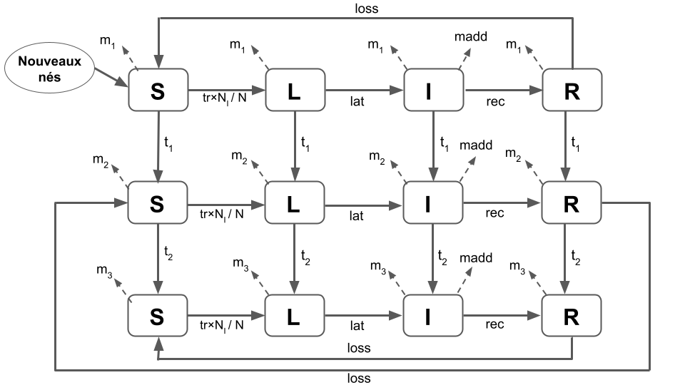
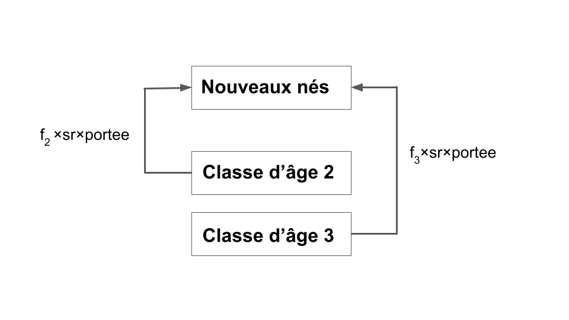
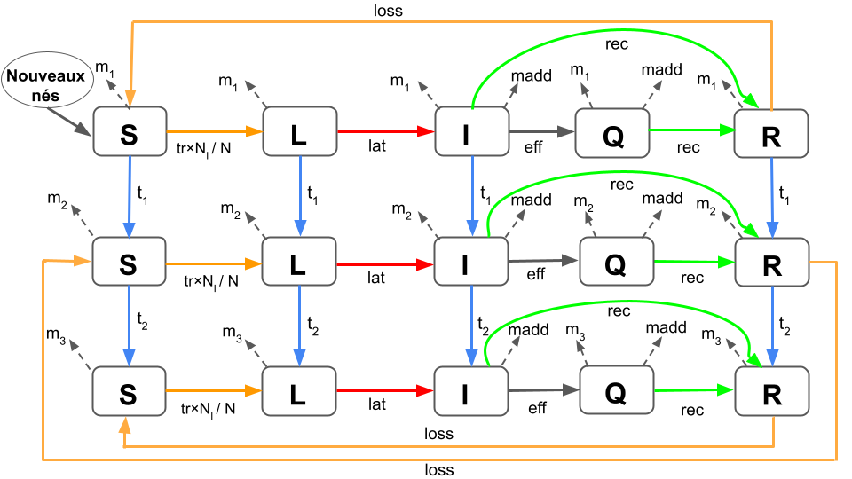

```{r setup, include=FALSE}
knitr::opts_chunk$set(echo = TRUE, warning = FALSE, message = FALSE, results = "hide")
```


```{r packages}
library(ggplot2) 
source("functionModProjet2023.r")
library(dplyr)
library(tidyr)
library(knitr) 
library(kableExtra)
library(reactable)
library(sensitivity)
library(labelled)
library(patchwork)
```


# Description du modèle

## Type de modèle

Ce modèle est deterministe parce qu'il est défini par des équations deterministes ne comportant aucun terme tiré aléatoirement. Il est basé sur un pas de temps discret et est un modèle à compartiments.

## Processus biologique

Le modèle simule la propagation d'une maladie dans une population en fonction de divers processus biologiques, tels que la transmission de la maladie, les taux de guérison, les taux de mortalité, les taux de naissance, etc. …….

## Equations associées 


Première classe d'âge : FAIRE LES REFERENCES

\begin{cases}
A_{S,t+1} = A_{S,t}\times(1-m_1-t-trans\times \frac{N_{I,t}}{N}) + loss \times A_{R,t} + max(0 , sr \times portée \times \sum_{i=1}^{4} B_{i, t} \times f_2 + \sum_{i=1}^{4} C_{i, t} \times f_3 \times (1- \frac{N}{K})) \\
A_{E,t+1} = A_{E,t}\times(1-m_1-t-lat) + trans \times A_{1,t} \times  A_{S,t} \times \frac{N_I}{N} \\
A_{I,t+1} = A_{I,t}\times(1-m_1-t-madd - rec) + lat \times A_{E,t} \\
A_{R,t+1} = A_{R,t}\times(1-m_1-t-loss) + rec \times A_{I,t} \\

\end{cases}

Deuxième classe d'âge : 

\begin{cases}

B_{S,t+1} = A_{S,t}\times t_1 + B_{S,t} \times (1-m_2 - t_2 - trans \times \frac{N_{I,t}}{N_t})+ loss \times B_{R,t} \\
B_{E,t+1} = A_{E,t}\times t_1 + B_{E,t} \times (1-m_2 - t_2 - lat) + trans \times B_{S,t} \times \frac {N_{I,t}}{N_t} \\
B_{I,t+1} = = A_{I,t}\times t_1 + B_{I,t} \times (1-m_2 - t_2 - madd - rec) + lat \times B_{2,t} \\
B_{R,t+1} = A_{R,t}\times t_1 + B_{R,t} \times (1-m_2 - t_2 - loss) + rec \times B_{3,t} \\

\end{cases}

Troisième classe d'âge : 
 
\begin{cases}

C_{S,t+1} = B_{S,t}\times t_2 + C_{S,t} \times (1-m_3 - trans \times \frac{N_{I,t}}{N_t}) + loss \times C_{R,t} \\
C_{E,t+1} = B_{E,t}\times t_2 + C_{E,t} \times (1-m_3 - lat) + trans \times C_{S,t} \times \frac {N_{I,t}}{N_t} \\
C_{I,t+1} = = B_{I,t}\times t_2 + C_{I,t} \times (1-m_3 -  madd - rec) + lat \times C_{2,t} \\
C_{R,t+1} = B_{R,t}\times t_2 + C_{R,t} \times (1-m_3 - t_2 - loss) + rec \times B_{3,t} \\

\end{cases}


## Schéma des transitions

 


## Hypothèses principales
- Transmission directe
- Population en trois classes d'âges
- Quatres états liés à la maladie : 1) susceptible, 2) latent, 3) infectieux et 4) retiré
- Ce sont uniquement les individus infectés qui peuvent transmettre la maladie;
- Les individus peuvent perdre leur immunité
- Transmission de la maladie par fréquence dépendante


## Conditions initiales
Au début de la simulation, il y avait un nombre spécifique d'individus dans chaque classe d'âge et état de santé:
- il y avait 27 individus dans la première classe d'âge et dans l'état de santé Susceptible
- il y avait 23 individus dans la deuxième classe d'âge et dans l'état de santé Susceptible
- il y avait 36 individus dans la troisième classe d'âge et dans l'état de santé Susceptible
- il y avait 1 individus dans la troisième classe d'âge et dans l'état de santé Infectieux


## Sorties possibles du modèle ***A CONFIRMER ***
Les sorties du modèle sont enregistrées dans la matrice sortie à la fin de chaque scénario de simulation. Les sorties possibles sont:
- Sortie 1=  pourcentage de la population dans les états de santé latente et infectieux par rapport à la population totale,
- Sortie 2= résultat de la fonction de transmission à la fin des deux années
- Sortie 3 = maximum du nombre d'individu dans l'état infectieux au fil des deux ans.
- Sortie 4 = somme des fonction de transmission au cours de la première année de la simulation


## Parametres du modèle
- K = 100 : Capacité maximale de la population
- sr =  0.5 : Taux de survie des descendants
- m1 =  0.0014 : Taux de mortalité naturelle de la première classe d’âge
- m2 =  0.00029 : Taux de mortalité naturelle  de la deuxième classe d’âge
- m3 =  0.0019 : Taux de mortalité naturelle  de la troisième classe d’âge
- f2 = 0.0019 : Taux de fécondité de la deuxième classe d’âge
- f3 =  0.0082 : Taux de fécondité de la troisième classe d’âge
- portee =  5 : Nombre total de descendant par individu
- t1 = 1/365: Transition de classe de 1 à 2
- t2 := 1/365: Transition de la classe 2 à 3
- trans =  0.3 probabilité qu’un individu susceptible devient latent
- lat = 1/5 : taux de passage de l'état latente à l'état infectieux
- rec =  1/20 : probabilité qu’un individu infecté devient immunisé
- loss = 1/100 : Probabilité qu’un individu immunisé redevienne susceptible
- madd = 0.001 : Mortalité causé par la maladie


## Figures 
***Peut être convertir la sorti generale de la fonction sous forme de tableau : colnames(sorties[[1]])***

```{r Figures mod1}

# Initialisation des paramètres 

nom = c("K", "sr", "m1", "m2", "m3", "f2", "f3", "portee", "t1", "t2", "trans", "lat", "rec", "loss", "madd"
)

ValNominale = c(100, 0.5, 0.0014, 0.00029, 0.0019, 0.0019, 0.0082, 5, 1/365, 1/365, 0.3, 1/5, 1/20, 1/100, 0.001)

parametres = matrix(data = ValNominale, ncol = 15)
colnames(parametres) <- nom

# Exécution du modèle

sorties = modAppli_bis(parametre = parametres) 
predictions = sorties[[2]][[1]]

# Sorties du modèle

colnames(sorties[[1]]) <- c("Part des \n infectés et latente \n instant final", "fct de transmission\n instant final", "Max infectieux", "somme\nfonction de transmission" )

sorties[[1]] %>%
  kable(format = "html", booktab = TRUE, caption = "Sorties du modèle")

# Représentations graphiques des prédictions.

    # plot en base

temps = 365*2

titres = c("Classe 1",
          "Classe 2",
          "Classe 3",
          "Population totale")


par(mfrow = c(2,2))

for (i in 1:4) {
plot_initial(classe = i, 
             titre = titres[i])
}


```

## Interprétation des figures


# Analyse de sensibilité : OAT

L'analyse de sensibilité "One-at-a-Time" (OAT) est une méthode qui vise à évaluer l'influence des paramètres d'un modèle sur ses résultats de manière individuelle. Cette approche consiste à modifier un paramètre à la fois, tout en maintenant les autres paramètres à leurs **valeurs nominales**, afin de mesurer l'impact de chaque paramètre sur les sorties du modèle **modAppli**.

## Choix des variations des paramètres
Nous avons sélectionné 5 valeurs en dessous et au-dessus des valeurs nominales pour constituer 10 valeurs pour chacune des 15 paramètres. Nous avons choisi un incrément (voir script ci-dessous) adapté à la grandeur de chaque paramètre.

## Script

```{r Analyse de sensibilité OAT}

# Saisie de la valeur des incréments par paramètre (dans l'ordre du vecteur "nom")

increment = c(1, 0.05, 0.0001, 0.00001, 0.0002, 0.0002,
  0.0003, 0.5, 0.0002, 0.0002, 0.03, 
  0.01, 0.0005, 0.0005, 0.0001
)

# Execution de la fonction "var_para" qui permet d'appliquer l'incrémentation à chaque paramètre.

all_parametres <- var_para(parametres = parametres, increment = increment)

# Execution de la fonction oat qui permet d'appliquer l'AS de type OAT et calculer les indices de sensiilité.

# Création d'un dataframe pour stocker les résultats
data_E <-
  data.frame(P = character(0), E1 = numeric(0), E2 = numeric(0), E3 = numeric(0), E4 = numeric(0)
  ) 

# Boucle pour faire passée les 15 parametres
for (t in 1:15) {
  
  results <- oat(matrices = all_parametres, parametres = t)
  
  # Créez un dataframe avec les résultats pour le paramètre t
  data_elas <- data.frame(
    P = as.factor(rep(results$Parametres, 10)),
    E1 = as.numeric(results$Elasticite[, 1]),
    E2 = as.numeric(results$Elasticite[, 2]),
    E3 = as.numeric(results$Elasticite[, 3]),
    E4 = as.numeric(results$Elasticite[, 4])
  )
  
  # Ajoutez les résultats au dataframe principal
  data_E <- rbind(data_E, data_elas)
  
}


```


## Figures
Les figures ci-dessous illustent le comportement du modèle concernant les résultats de l'analyse de sansibilité OAT aevc l'indice d'Elasticité (sensibilité relative) pour chacune des quatres sorties du modèle (E1, E2, E3 et E4).
```{r}
# Représentations graphiques de l'élasticité pour chaque paramètre

# Utilisation de abs() à toutes les colonnes numeric 
data_E1 <- data_E %>%
  mutate_if(is.numeric, abs)

data_E2 <- data_E1 %>% 
  pivot_longer(cols = c("E1", "E2", "E3", "E4"), names_to = "sorties", values_to = "Elasticite") # pivot pour formater le jeu de données --> ggplot

data_E2$sorties <- as.factor(data_E2$sorties)

data_E2 %>%
  ggplot(aes(x = P, y = Elasticite))+
  geom_boxplot() +
  theme_classic()+
  facet_wrap(vars(sorties), ncol = 1)

```

## Interpretation et limites
Les paramètres "rec", "loss", "trans", et "lat" exercent une influence prépondérante sur la sortie 1 qui était le pourcentage de la population dans les états de santé latents et infectieux par rapport à la population totale. Pour la sortie 2 qui était le résultat de la fonction de transmission des deux années de suivi, ce sont les paramètres "K" et "loss" qui démontrent la plus grande influence. Quant au maximum de la population dans l'état infectieux au fil des deux ans, ce sont les paramètres "rec", "trans", "K", et "lat" qui se révèlent être les plus significatifs. Enfin, en ce qui concerne la sortie 4 qui était la somme des fonctions de transmission au cours de la première année de la simulation, ce sont les paramètres "K", "loss", et "trans" qui affichent la plus forte influence.


L'analyse de sensibilité basée sur One-at-a-Time (OAT) ne fournit des informations sur les influences que dans le voisinage des *valeurs nominales* appliquées. De plus, elle ne permet pas de mettre en évidence les *effets des interactions* entre les paramètres. Cette méthode d'analyse de sensibilité n'est pas particulièrement adaptée à notre *modèle non linéaire*, car l'OAT est une approche locale. Dans sa forme la plus simple, elle fournit des *dérivées partielles* du modèle par rapport aux paramètres d'entrée.


# Analyse de sensibilité : Moris
L'analyse de sensibilité de type Morris est une méthode qui sert à évaluer la sensibilité d'un modèle avec un choix aléatoire de trajectoires.
 
```{r Analyse de sensibilité morris}

all_parametres <- var_para(parametres = parametres, increment = increment)
sorti_morris <- morris(
  model = modAppli,
  factors = nom, 
  r = 5,
  design = list(
    type = "oat",n=100,
    levels = 6,
    grid.jump = 3
  ),
  binf = all_parametres[1, ], 
  bsup = all_parametres[11, ] 
)

# Reccuper la sortie de Morris pour les graphique
mu <- apply(sorti_morris$ee, 3, function(M){
  apply(M, 2, mean)
})
mu.star <- apply(abs(sorti_morris$ee), 3, function(M){
  apply(M, 2, mean)
})
sigma <- apply(sorti_morris$ee, 3, function(M){
  apply(M, 2, sd)
})

mu.star= as.data.frame(mu.star)
sigma= as.data.frame(sigma)


```


## Figures
L'analyse de sensibilité "Morris" révèle que la plupart des paramètres ont des effets négligeables, notamment sur la sortie 1. En revanche, pour les sorties 3 et 4, tous les paramètres présentent des effets non linéaires et/ou avec des interactions significatives. De plus, en ce qui concerne la sortie 2, seul le paramètre "loss" montre un effet non linéaire, tandis que tous les autres paramètres ont des effets négligeables.


*Legendes figures*
- entrées ayant des effets négligeables (en jaune),
- entrées ayant des effets linéaires et sans interaction (orange),
- entrées ayant des effets non linéaires et/ou avec interactions (bleu)

```{r, fig.height = 6}

# zone de graphique en 2 colonnes et 2 lignes
par(mfrow=c(2,2))


# Sortie 1
plot(0.1, 0.1, type="n", ylim=c(0, 0.005), xlim=c(0, 0.06), xlab="mu.star", ylab="sigma")
polygon(x = c(0,0,100), y = c(0,100,0), col = "skyblue", border = NA)
polygon(x = c(0,0,0.1), y = c(0,100,0), col = "yellow", border = NA)
polygon(x = c(0.1,100,0.1), y = c(0,0.1,0.1), col = "orange", border = NA)
points(mu.star$ycol1, sigma$ycol1)
text(mu.star$ycol1, sigma$ycol1, labels = row.names(sigma), cex = 1.3, pos = 3)
title("Sortie 1")

# Sortie 2
plot(0.1, 0.1, type="n", ylim=c(0, 0.040), xlim=c(0, 0.30), xlab="mu.star", ylab="sigma")
polygon(x = c(0,0,100), y = c(0,100,0), col = "skyblue", border = NA)
polygon(x = c(0,0,0.1), y = c(0,100,0), col = "yellow", border = NA)
polygon(x = c(0.1,100,0.1), y = c(0,0.01,0.01), col = "orange", border = NA)
points(mu.star$ycol2, sigma$ycol2)
text(mu.star$ycol2, sigma$ycol2, labels = row.names(sigma), pos = 3, cex = 1.3)
title("Sortie 2")

# Sortie 3
plot(0.1, 0.1, type="n", ylim=c(0, 1.4), xlim=c(0, 12), xlab="mu.star", ylab="sigma")
polygon(x = c(0,0,100), y = c(0,100,0), col = "skyblue", border = NA)
polygon(x = c(0,0,0.1), y = c(0,100,0), col = "yellow", border = NA)
polygon(x = c(0.1,900,0.1), y = c(0,0,0.1), col = "orange", border = NA)
points(mu.star$ycol3, sigma$ycol3)
text(mu.star$ycol3, sigma$ycol3, labels = row.names(sigma), pos = 3, cex = 1.3)
title("Sortie 3")

# Sortie 4
plot(0.1, 0.1, type="n", ylim=c(0, 12), xlim=c(0, 90), xlab="mu.star", ylab="sigma")
polygon(x = c(0,0,200), y = c(0,100,0), col = "skyblue", border = NA)
polygon(x = c(0,0,0.1), y = c(0,5000,0), col = "yellow", border = NA)
polygon(x = c(0.1,5000,0.1), y = c(0,0,0.1), col = "orange", border = NA)
points(mu.star$ycol4, sigma$ycol4)
text(mu.star$ycol4, sigma$ycol4, labels = row.names(sigma), pos = 3, cex = 1.3)
title("Sortie 4")


```


## Comparaison entre OAT et Moris

En comparant les deux approches, on constate que l'approche OAT se concentre sur des résultats avec des objectif qualitative spécifiques à chaque parametres, tandis que la méthode Morris offre une perspective plus globale sur les effets des paramètres. Néanmoins, on retrouve des conclusions similaires concernant les paramètres les plus influents, qui sont principalement "loss", "trans", "portée" et "K".


# Méthode FAST

## Package

Nous avons utilisé le package "sensitivity" (version 1.28.1) pour effectuer une analyse de sensibilité du modèle avec la méthode FAST. La fonction utilisée est "fast99" qui implémente la méthode "FAST - étendue" (Saltelli et al. 1999). Les éléments les plus importants pouvant être modulés sont : 

- le modèle analysé
- le nombre de simulations
- La loi de probabilité utilisée.
- Les paramètres de cette loi de probabilité

Cette méthode a un coup $n\timesp$ simulations. Avec $n$ le nombre de scénarios par paramètres et $p$ le nombre de paramètres. Il faut choisir le nombre de simulations en fonction du nombre de paramètres analysés. plus le nombre de paramètres augmente, plus le nombre de simulation devient couteux en terme de temps de calcul.


## Premier échantillonnage avec peu de simulation par paramètre.


```{r Analyse FAST 100 simulations}

## Initialisation des paramètres des lois de probailité utilisée

# Lois normale
borne_para_norm <- apply(all_parametres,
                     2,
                     function(x) {
                       list(mean = mean(x), sd = sd(x))
                     })

#Lois uniforme
borne_para_unif <- apply( cbind(all_parametres[1,],
                           all_parametres[11,]),
                     1,
                     function(x){list(min=x[1],max=x[2])} )

# Calcul pour 100 simulations 

fast100 <- fast99(model=NULL, 
                      factors=nom,
                      n=100,
                      q=rep("qunif",15),
                      q.arg=borne_para_unif)

# Présentation du nombre de simulations
kable(data.frame("nombre de\nsimulations" = nrow(fast100$X),
                 "nombre de\nparamètres" = ncol(fast100$X)),
      format = "html")

```

L'échantillonnage avec 100 scénarios par paramètres fait 1500 simulations.


## Illustration des variations des paramètres obtenues

```{r Echantillonnage avec 1000 scénarios, fig.lenght = 8}

# sauvegarde du tableau
param_fast_100 <- fast100$X

  
graphs = list()

for (i in nom){
  plooot <- ggplot(param_fast_100, aes_string(y = i, x =   1:nrow(param_fast_100)))+
    xlab("Indice")+
    geom_point()+
    theme_classic()
  graphs[which(nom==i)] <- list(plooot) 
  }

names(graphs) <- nom

library(ggpubr)

ggarrange(plotlist = graphs, ncol = 3)

```


## Echantillonnage avec 1000 scénarios par paramètres

```{r}

fast1000 <- fast99(model=NULL,
                  factors=nom,
                  n=1000,
                  q=rep("qunif",15),
                  q.arg=borne_para_unif)


# Stock des paramètres échantillonnés

param_fast_1000 <- fast1000$X

  
graphs = list()

for (i in nom){
  plooot <- ggplot(param_fast_1000, aes_string(y = i, x =   1:nrow(param_fast_1000)))+
    xlab("Indice")+
    geom_point()+
    theme_classic()
  graphs[which(nom==i)] <- list(plooot) 
  }

names(graphs) <- nom


ggarrange(plotlist = graphs, ncol = 3)


```

## Comparaison et discussion des deux échantillonnages

L'échantillonnage avec 100 scénario par paramètre présente moins de valeurs intermédiaires pour chaque paramètre que l'échantillonnage à 1000 scénarios. L'échantillonnage à 1000 scénarios est plus précis et parcimonieux. Il est à privilégier dans le cas où la puissance de calcul est suffisante. 

## Lancement du modèle sur ces deux échantillonnages


```{r, cache=TRUE}
# Lancement du modèle avec les 100 scénarios

noms_sorties = c("sortie_1", 
         "sortie_2",
         "sortie_3",
         "sortie_4")


sorties_100 <- modAppli(parametre = param_fast_100)
colnames(sorties_100) <- noms_sorties
sorties_100 <- as.data.frame(sorties_100)

kable(head(sorties_100))

# Lancement du modèle avec les 1000 scénarios

sorties_1000 <- modAppli(parametre = param_fast_1000)
colnames(sorties_1000) <- noms_sorties
sorties_1000 <- as.data.frame(sorties_1000)


```

## Distribution des sorties obtenues

- Pour 100 échantillonnages :
```{r}

# histogrammes des sorties pour visualiser leur distribution.

noms_sorties_bis = c("sortie 1", 
         "sortie 2",
         "sortie 3",
         "sortie 4")

list_histo_100 = list()

for (i in noms_sorties) {
  histo <- histo_sorties(sorties_100, y = i)
  list_histo_100[[which(noms_sorties==i)]] = histo
}
ggarrange(plotlist = list_histo_100, ncol = 2,
          labels = noms_sorties_bis)

```

- Pour 1000 échantillonnages : 

```{r}

# histogrammes des sorties pour visualiser leur distribution.

noms_sorties_bis = c("sortie 1", 
         "sortie 2",
         "sortie 3",
         "sortie 4")

list_histo_1000 = list()

for (i in noms_sorties) {
  histo <- histo_sorties(sorties_1000, y = i)
  list_histo_1000[[which(noms_sorties==i)]] = histo
}

ggarrange(plotlist = list_histo_1000, ncol = 2,
          labels = noms_sorties_bis)

```
Les distributions des sorties issues de l'échantillonnage par méthode FAST avec 1000 scénrios sont graphiquement beaucoup plus conformes à la lois normale, excépté pour la sortie 3 qui ne présente pas une distribution normale. Les indices utilisés ici sont des estimations de variances des espérances conditionnelles (VCE) qui reposent sur l'hypothèse de normalité de la distribution des données (McKay, M. D. (1995)). Il est préférable de réaliser ces analyses sur les sorties issues de 1000 échantillonnages par paramètres. De plus, la distribution de la sortie 3 n'est pas interprétable.


## Indices principaux et d'ordre 2, visualisation graphique des résultats

```{r}
# stockage fast1000 & fast100

# fast100 :
indices_fast100 = list()
for (i in 1:4){
  fast100_bis <- fast100
  a = tell(fast100_bis, sorties_100[,i])
  indices_fast100[[i]] <- a
}
names(indices_fast100) <- noms_sorties

# fast 1000 :

indices_fast1000 = list()
for (i in 1:4){
  fast1000_bis <- fast1000
  a = tell(fast1000_bis, sorties_1000[,i])
  indices_fast1000[[i]] <- a
}
names(indices_fast1000) <- noms_sorties


# Plot fast100

list_bar <- list()
for (i in 1:4) {
 p <- histo_results(indices_fast100, noms_sorties[i], 
                    titre = noms_sorties_bis[i])
 list_bar[[i]] = p
}

(list_bar[[1]] + list_bar[[2]]) / (list_bar[[3]] + list_bar[[4]])


# Plot fast1000


list_bar <- list()
for (i in 1:4) {
 p <- histo_results(indices_fast1000, noms_sorties[i], titre = noms_sorties_bis[i])
 list_bar[[i]] = p
}

(list_bar[[1]] + list_bar[[2]]) / (list_bar[[3]] + list_bar[[4]])


```


## Comparaison des échantillonnages

L'échantillonnage de 1000 scénarios par paramètre présente une plus grande importance des paramètres loss, portee, sr et trans pour les sorties 2 et 4. Pour la sortie, l'échantillonnage de 1000 scénarios par paramètre permet de détecter un effet du paramètre m3. L'échantillonnage de 100 scénario par paramètre présente un plus faible effet principal pour la sortie 1. Les deux échantillonnages présentent des résultats similaires pour la sortie 3.
Nottons que aucun des deux échantillonnage issu de la méthode FAST ne permet de détecter d'effet d'interaction.

## Interprétation biologique

La sortie 1 correspond à la prévalence de la maladie à l'état final des simulations. Cette prévalence est principalement guidée par le coefficient de transmission de la maladie (trans) ainsi que par le temps d'incubation de la maladie (1/loss). La sortie 2 correspond à la valeur de la fonction de transmission de la maladie, ce qui permet de mettre en évidence le caractère épidémique ou endémique de la propagassion de la maladie. Les résultats de l'analyse FAST nous permet de mettre en évidence l'importance du coefficient de transmission et du temps d'incubation de la maladie pour cette sortie. Nottons une sensibilité de cette sortie aux paramètre liés à la natalité des individus.
La sortie 4 correspond au nombre maximal d'individus infectieux lors des simulations. Le paramètre de transmission est le plus important. Nottons que le coefficient de transmission de la maladie est influant pour l'ensemble des sorties du modèle.


# Discussion


# Scénario

## Documenatation

Voici notre proposition de modification du modèle : Lorsque la proportion de décès dus à la maladie par rapport à l'effectif total de la population devient trop élevée, tous les individus testés positifs sont dirigés vers le compartiment de la "quarantaine". Ce mécanisme s'enclenche uniquement lorsque le nombre de décès attribuables à la maladie parmi les individus infectés dépasse un certain "seuil" de la population totale, suivant :
$N_{i,t}\times madd < seuil \times N_t$. Ainsi, tous les individus infectieux testés positifs sont transférés dans le compartiment de la quarantaine, affichant à la fois des taux de mortalité naturelle $(m_{1:3})$ identiques à ceux des autres états de santé et des taux de mortalité liés à la maladie (madd) similaires aux infectieux. Enfin, les individus en quarantaine peuvent développer une immunité au bout d'une certaine période (rec).


## Equations

\begin{cases}

A_{S,t+1} = A_{S,t}\times(1-m_1-t_1-trans\times \frac{N_{I,t}}{N}) + loss \times A_{R,t} + max(0 , sr \times portée \times \sum_{i=1}^{4} B_{i, t} \times f_2 + \sum_{i=1}^{4} C_{i, t} \times f_3 \times (1- \frac{N}{K})) \\
A_{E,t+1} = A_{E,t}\times(1-m_1-t_1-lat) + trans \times A_{1,t} \times  A_{S,t} \times \frac{N_I}{N} \\
A_{I,t+1} = A_{I,t}\times(1-m_1-t_1-madd - rec - eff) + lat \times A_{E,t} \\
A_{Q,t+1} = A_{Q,t}\times(1-m_1-t_1-madd - rec) + eff \times A_{I,t} \\
A_{R,t+1} = A_{R,t}\times(1-m_1-t_1-loss) + rec \times (A_{I,t} +  A_{Q,t})\\

\end{cases}

\begin{cases}

B_{S,t+1} = A_{S,t}\times t_2 + B_{S,t} \times (1-m_2 - t_2 - trans \times \frac{N_{I,t}}{N_t})+ loss \times B_{R,t} \\
B_{E,t+1} = A_{E,t}\times t_2 + B_{E,t} \times (1-m_2 - t_2 - lat) + trans \times B_{S,t} \times \frac {N_{I,t}}{N_t} \\
B_{I,t+1} = = A_{I,t}\times t_2 + B_{I,t} \times (1-m_2 - t_2 - madd - rec - eff) + lat \times B_{2,t} \\
B_{Q,t+1} = A_{Q,t}\times t_2 + B{Q,t}\times(1-m_1-t_2-madd - rec) + eff \times B_{I,t} \\
B_{R,t+1} = A_{R,t}\times t_2 + B_{R,t} \times (1-m_2 - t_2 - loss) + rec \times (B_{I,t} +  B_{Q,t}) \\

\end{cases}


\begin{cases}

C_{S,t+1} = B_{S,t}\times t_2 + C_{S,t} \times (1-m_3 - trans \times \frac{N_{I,t}}{N_t}) + loss \times C_{R,t} \\
C_{E,t+1} = B_{E,t}\times t_2 + C_{E,t} \times (1-m_3 - lat) + trans \times C_{S,t} \times \frac {N_{I,t}}{N_t} \\
C_{I,t+1} = = B_{I,t}\times t_2 + C_{I,t} \times (1-m_3 -  madd - rec - eff) + lat \times C_{2,t} \\
C_{Q,t+1} = B_{Q,t}\times t_2 + C{Q,t}\times(1-m_1-t_2-madd - rec) + eff \times C_{I,t} \\
C_{R,t+1} = B_{R,t}\times t_2 + C_{R,t} \times (1-m_3 - t_2 - loss) + rec \times (C_{I,t} +  C_{Q,t}) \\

\end{cases}

## Schéma



## Figures
```{r, echo=TRUE}
nom_scenar = c("K", "sr", "m1", "m2", "m3", "f2", "f3", "portee", "t1", "t2", "trans", "lat", "rec", "loss", "madd", "eff", "seuil"
)


par(mfrow=c(1, 2))

# CAS 1  SANS QUARANTAINE
parametres_scena = c(100, 0.5, 0.0014, 0.00029, 0.0019, 0.0019, 0.0082, 5, 1/365, 1/365, 0.3, 1/5, 1/20, 
                1/100, 0.005, 0, 0)
  
sorti_scenario=modAppli_scenario_bis(parametre = matrix(parametres_scena, nrow=1))

plot(1:temps, sorti_scenario[,1], type = "l", col = "purple", lwd = 2, 
     xlab = "temps (jours)", ylab = "Effectif", main = "Cas1: Sans quarantaine", ylim=c(0, 100))
lines(sorti_scenario[,2], col = "orange", lwd = 2)
lines(sorti_scenario[,3], col = "red", lwd = 2)
lines(sorti_scenario[,4], col = "blue", lwd = 2)
lines(sorti_scenario[,5], col = "green", lwd = 2)
lines(sorti_scenario[,5]+ sorti_scenario[,1] + sorti_scenario[,4]+sorti_scenario[,3]+sorti_scenario[,2], lwd = 2)
legend(x = "topright", legend = c("Susceptibles",
                                  "Latents", 
                                  "Infectieux", 
                                  "Quarantaines",
                                  "Immunisés",
                                  "Population totale"), 
       col = c("purple", "orange", "red", "blue", "green", "black"),lty = 1,
       cex = 0.5)


  
  # CAS 2  AVEC QUARANTAINE
  parametres_scena = c(100, 0.5, 0.0014, 0.00029, 0.0019, 0.0019, 0.0082, 5, 1/365, 1/365, 0.3, 1/5, 1/20, 1/100, 0.001, 0.8, 0.00005)
  
  sorti_scenario=modAppli_scenario_bis(parametre = matrix(parametres_scena, nrow=1))
  
  plot(1:temps, sorti_scenario[,1], type = "l", col = "purple", lwd = 2, 
       xlab = "temps (jours)", ylab = "Effectif", main = "Cas2: Avec quarantaine", ylim=c(0, 100))
  lines(sorti_scenario[,2], col = "orange", lwd = 2)
  lines(sorti_scenario[,3], col = "red", lwd = 2)
  lines(sorti_scenario[,4], col = "blue", lwd = 2)
  lines(sorti_scenario[,5], col = "green", lwd = 2)
  lines(sorti_scenario[,5]+ sorti_scenario[,1] +  sorti_scenario[,4]+sorti_scenario[,3]+sorti_scenario[,2], lwd = 2)
  legend(x = "topright", legend = c("Susceptibles",
                                    "Latents", 
                                    "Infectieux", 
                                    "Quarantaines",
                                    "Immunisés",
                                    "Population totale"), 
         col = c("purple", "orange", "red", "blue", "green", "black"),lty = 1,
         cex = 0.5)


```

## Analyses de sansibilités

### OAT


```{r Analyse de sensibilité OAT scena}

parametres_scena = c(100, 0.5, 0.0014, 0.00029, 0.0019, 0.0019, 0.0082, 5, 1/365, 1/365, 0.3, 1/5,     1/20, 1/100, 0.005, 0.9, 0.005)

parametres_scena = matrix(data = parametres_scena, ncol = 17)
colnames(parametres_scena) <- nom_scenar

# Saisie de la valeur des incréments par paramètre (dans l'ordre du vecteur "nom")

increment = c(1, 0.05, 0.0001, 0.00001, 0.0002, 0.0002,
  0.0003, 0.5, 0.0002, 0.0002, 0.03, 
  0.01, 0.0005, 0.0005, 0.0001,0.01,0.0001
)

# Execution de la fonction "var_para" qui permet d'appliquer l'incrémentation à chaque paramètre.

all_parametres <- var_para(parametres = parametres_scena, increment = increment,nom_para=nom_scenar)


# Execution de la fonction oat qui permet d'appliquer l'AS de type OAT et calculer les indices de sensiilité.

# Création d'un dataframe pour stocker les résultats
data_E <-
  data.frame(P = character(0), E1 = numeric(0), E2 = numeric(0), E3 = numeric(0), E4 = numeric(0)
  ) 

# Boucle pour faire passée les 15 parametres
for (t in 1:17) {
  
  results <- oat(matrices = all_parametres, parametres = t,fonction = "modAppli_scenario")
  
  # Créez un dataframe avec les résultats pour le paramètre t
  data_elas <- data.frame(
    P = as.factor(rep(results$Parametres, 10)),
    E1 = as.numeric(results$Elasticite[, 1]),
    E2 = as.numeric(results$Elasticite[, 2]),
    E3 = as.numeric(results$Elasticite[, 3]),
    E4 = as.numeric(results$Elasticite[, 4])
  )
  
  # Ajoutez les résultats au dataframe principal
  data_E <- rbind(data_E, data_elas)
  
}


```


#### Figures OAT

```{r}
# Représentations graphiques de l'élasticité pour chaque paramètre

# Utilisation de abs() à toutes les colonnes numeric 
data_E1 <- data_E %>%
  mutate_if(is.numeric, abs)

data_E2 <- data_E1 %>% 
  pivot_longer(cols = c("E1", "E2", "E3", "E4"), names_to = "sorties", values_to = "Elasticite") # pivot pour formater le jeu de données --> ggplot

data_E2$sorties <- as.factor(data_E2$sorties)

data_E2 %>%
  ggplot(aes(x = P, y = Elasticite))+
  geom_boxplot() +
  theme_classic()+
  facet_wrap(vars(sorties), ncol = 1)

```

Les paramètres eff et seuil n'ont significativement influencé les 4 sortie du modèle avec le scénario.


### Morris

```{r Analyse de sensibilité morris scena}

parametres_scena = c(100, 0.5, 0.0014, 0.00029, 0.0019, 0.0019, 0.0082, 5, 1/365, 1/365, 0.3, 1/5,     1/20, 1/100, 0.005, 0.9, 0.005)

parametres_scena = matrix(data = parametres_scena, ncol = 17)
colnames(parametres_scena) <- nom_scenar

# Saisie de la valeur des incréments par paramètre (dans l'ordre du vecteur "nom")

increment = c(1, 0.05, 0.0001, 0.00001, 0.0002, 0.0002,
  0.0003, 0.5, 0.0002, 0.0002, 0.03, 
  0.01, 0.0005, 0.0005, 0.0001,0.01,0.0001
)

# Execution de la fonction "var_para" qui permet d'appliquer l'incrémentation à chaque paramètre.

all_parametres_scena <- var_para(parametres = parametres_scena, increment = increment,nom_para=nom_scenar)

sorti_morris <- morris(
  model = modAppli_scenario,
  factors = nom_scenar, 
  r = 5,
  design = list(
    type = "oat",n=100,
    levels = 6,
    grid.jump = 3
  ),
  binf = all_parametres_scena[1, ], 
  bsup = all_parametres_scena[11, ] 
)

# Reccuper la sortie de Morris pour les graphique
mu <- apply(sorti_morris$ee, 3, function(M){
  apply(M, 2, mean)
})
mu.star <- apply(abs(sorti_morris$ee), 3, function(M){
  apply(M, 2, mean)
})
sigma <- apply(sorti_morris$ee, 3, function(M){
  apply(M, 2, sd)
})

mu.star= as.data.frame(mu.star)
sigma= as.data.frame(sigma)


```


#### Figures morris 


*Legendes figures*
- entrées ayant des effets négligeables (en jaune),
- entrées ayant des effets linéaires et sans interaction (orange),
- entrées ayant des effets non linéaires et/ou avec interactions (bleu)

```{r, fig.height = 6}

# zone de graphique en 2 colonnes et 2 lignes
par(mfrow=c(2,2))


# Sortie 1
plot(0.1, 0.1, type="n", ylim=c(0, 0.005), xlim=c(0, 0.07), xlab="mu.star", ylab="sigma")
polygon(x = c(0,0,100), y = c(0,100,0), col = "skyblue", border = NA)
polygon(x = c(0,0,0.1), y = c(0,100,0), col = "yellow", border = NA)
polygon(x = c(0.1,100,0.1), y = c(0,0.1,0.1), col = "orange", border = NA)
points(mu.star$ycol1, sigma$ycol1)
text(mu.star$ycol1, sigma$ycol1, labels = row.names(sigma), cex = 1.3, pos = 3)
title("Sortie 1")

# Sortie 2
plot(0.1, 0.1, type="n", ylim=c(0, 0.040), xlim=c(0, 0.30), xlab="mu.star", ylab="sigma")
polygon(x = c(0,0,100), y = c(0,100,0), col = "skyblue", border = NA)
polygon(x = c(0,0,0.1), y = c(0,100,0), col = "yellow", border = NA)
polygon(x = c(0.1,100,0.1), y = c(0,0.01,0.01), col = "orange", border = NA)
points(mu.star$ycol2, sigma$ycol2)
text(mu.star$ycol2, sigma$ycol2, labels = row.names(sigma), pos = 3, cex = 1.3)
title("Sortie 2")

# Sortie 3
plot(0.1, 0.1, type="n", ylim=c(0, 1.4), xlim=c(0, 12), xlab="mu.star", ylab="sigma")
polygon(x = c(0,0,100), y = c(0,100,0), col = "skyblue", border = NA)
polygon(x = c(0,0,0.1), y = c(0,100,0), col = "yellow", border = NA)
polygon(x = c(0.1,900,0.1), y = c(0,0,0.1), col = "orange", border = NA)
points(mu.star$ycol3, sigma$ycol3)
text(mu.star$ycol3, sigma$ycol3, labels = row.names(sigma), pos = 3, cex = 1.3)
title("Sortie 3")

# Sortie 4
plot(0.1, 0.1, type="n", ylim=c(0, 12), xlim=c(0, 90), xlab="mu.star", ylab="sigma")
polygon(x = c(0,0,200), y = c(0,100,0), col = "skyblue", border = NA)
polygon(x = c(0,0,0.1), y = c(0,5000,0), col = "yellow", border = NA)
polygon(x = c(0.1,5000,0.1), y = c(0,0,0.1), col = "orange", border = NA)
points(mu.star$ycol4, sigma$ycol4)
text(mu.star$ycol4, sigma$ycol4, labels = row.names(sigma), pos = 3, cex = 1.3)
title("Sortie 4")


```

L'analyse de sensibilité de Morris sur le modèle (avec scénario) révèle que tous les paramètres ont des effets négligeables sur les deux premières sorties, tandis que l'inverse est observé pour les sorties 3 et 4. L'introduction des deux nouveaux paramètres (eff et seuil) a donc modifié l'influence des paramètres. On peut également noter que les deux nouveaux paramètres ne se distinguent pas particulièrement parmi l'ensemble des sorties.


### FAST

#### Echantillonnage des paramètres par méthode FAST

Un échantillonnage avec 1000 simulations par paramètre est réalisée avec la méthode FAST, en utilisant une loi uniforme.


```{r Analyse FAST 100 simulations scena}

## Initialisation des paramètres des lois de probabilité utilisée


#Lois uniforme
borne_para_unif_scena <- apply( cbind(all_parametres_scena[1,],
                           all_parametres_scena[11,]),
                     1,
                     function(x){list(min=x[1],max=x[2])} )

# Calcul pour 1000 simulations 

fast1000_scena <- fast99(model=NULL, 
                      factors=nom_scenar,
                      n=1000,
                      q=rep("qunif",17),
                      q.arg=borne_para_unif_scena)

param_fast_1000_scena <- fast1000_scena$X

# Présentation du nombre de simulations
kable(data.frame("nombre de\nsimulations" = nrow(fast1000_scena$X),
                 "nombre de\nparamètres" = ncol(fast1000_scena$X)),
      format = "html")

```

Vérification des distributions des sorties issues de cet échantillonnage.


```{r}
# Lancement du modèle pour l'ensemble des paramètres échantillonnés 

sorties_1000_scena <- modAppli_scenario(parametre = param_fast_1000_scena)
colnames(sorties_1000_scena) <- noms_sorties
sorties_1000_scena <- as.data.frame(sorties_1000_scena)


# histogrammes des sorties pour visualiser leur distribution.


list_histo_1000_scena = list()

for (i in noms_sorties) {
  histo <- histo_sorties(sorties_1000_scena, y = i)
  list_histo_1000_scena[[which(noms_sorties==i)]] = histo
}
ggarrange(plotlist = list_histo_1000_scena, ncol = 2,
          labels = noms_sorties_bis)

```

La distribution des valeurs de la sortie 3 ne suit pas graphiquement la loi normale. Cette sortie n'est pas interprétable avec une analyse de variance (VCE).
Les distributions des sorties 1, 2 et 4 suivent graphiquement la loi normale. Elles sont interpréatbles avec une analyse de variance (VCE).

```{r}

# stockage fast1000 
# fast 1000 :

indices_fast1000_scena = list()
for (i in 1:4){
  fast1000_bis <- fast1000_scena
  a = tell(fast1000_bis, sorties_1000_scena[,i])
  indices_fast1000_scena[[i]] <- a
}
names(indices_fast1000_scena) <- noms_sorties


# Plot fast1000


list_bar <- list()
for (i in 1:4) {
 p <- histo_results(indices_fast1000_scena, noms_sorties[i], titre = noms_sorties_bis[i], parametres = param_fast_1000_scena)
 list_bar[[i]] = p
}

(list_bar[[1]] + list_bar[[2]]) / (list_bar[[3]] + list_bar[[4]])


```

## Discussion

En comparaison avec le modèle initial, nous avons constaté que les résultats issus de l'analyse de sansibilité OAT  et morris n'ont pas changé avec le modèle avec le scénario. Cependant, avec la méthode FAST, nous avons trouvé que le parametres seuil à une trés grande influence sur les sorties du modèles.


